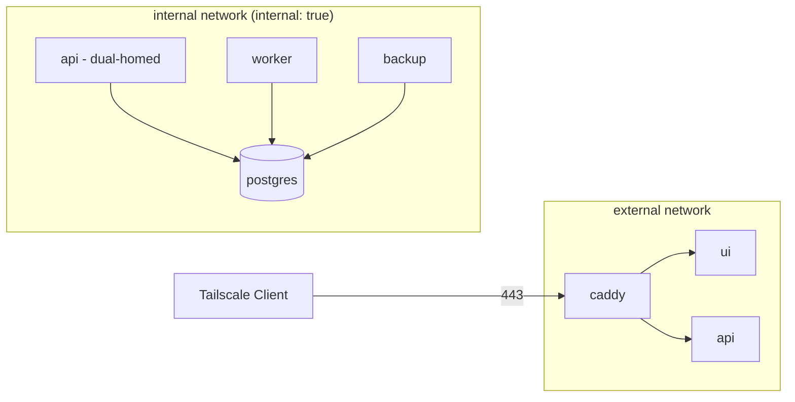

# デプロイ・コンテナ構成詳細設計

## 1. 概要

本ドキュメントは、自宅NAS上に構築するDocker Composeスタックの詳細設計を示す。概要設計 §7 を土台とし、各コンテナの役割、ネットワーク方針、永続ボリューム、リバースプロキシ設定、Tailscale接続、バックアップ運用、ログ・監視、アップグレード手順を定義する。

設計原則: ADR-009（NAS + Docker Compose採用）、ADR-010（Tailscale限定アクセス）、ADR-012（バックアップ3階層）。

## 2. docker-compose.yml

```yaml
# /volume1/docker/kakeibo/docker-compose.yml
services:
  postgres:
    image: postgres:16-alpine
    environment:
      POSTGRES_DB: kakeibo
      POSTGRES_USER: kakeibo
      POSTGRES_PASSWORD_FILE: /run/secrets/pg_password
    volumes:
      - ./data/pg:/var/lib/postgresql/data
      - ./backup:/backup
    secrets:
      - pg_password
    networks: [internal]
    restart: unless-stopped
    healthcheck:
      test: ["CMD-SHELL", "pg_isready -U kakeibo"]
      interval: 30s
      timeout: 5s
      retries: 3

  api:
    build: ./api
    depends_on:
      postgres:
        condition: service_healthy
    environment:
      DATABASE_URL: postgresql://kakeibo@postgres:5432/kakeibo
      ANTHROPIC_API_KEY_FILE: /run/secrets/anthropic_key
      TZ: Asia/Tokyo
    secrets:
      - anthropic_key
      - pg_password
    networks: [internal, external]
    restart: unless-stopped

  worker:
    build: ./worker
    depends_on:
      postgres:
        condition: service_healthy
    volumes:
      - ./inbox:/inbox:rw
      - ./archive:/archive:rw
      - ./dead_letter:/dead_letter:rw
    environment:
      DATABASE_URL: postgresql://kakeibo@postgres:5432/kakeibo
      INBOX_PATH: /inbox
      ARCHIVE_PATH: /archive
      DEAD_LETTER_PATH: /dead_letter
      TZ: Asia/Tokyo
    secrets:
      - pg_password
      - gmail_oauth_token
      - paypal_api_secret
      - anthropic_key
    networks: [internal]
    restart: unless-stopped

  ui:
    build: ./ui
    depends_on: [api]
    networks: [external]
    restart: unless-stopped

  caddy:
    image: caddy:2-alpine
    volumes:
      - ./Caddyfile:/etc/caddy/Caddyfile:ro
      - ./caddy_data:/data
      - ./caddy_config:/config
    networks: [external]
    ports:
      - "127.0.0.1:8443:443"   # Tailscale経由のみアクセス可
    restart: unless-stopped

  backup:
    image: postgres:16-alpine
    volumes:
      - ./backup:/backup
    command: >
      sh -c "while true; do
        PGPASSWORD=$$(cat /run/secrets/pg_password)
        pg_dump -h postgres -U kakeibo kakeibo | gzip > /backup/$$(date +%Y%m%d).sql.gz;
        find /backup -name '*.sql.gz' -mtime +30 -delete;
        sleep 86400;
      done"
    secrets:
      - pg_password
    depends_on:
      postgres:
        condition: service_healthy
    networks: [internal]
    restart: unless-stopped

networks:
  internal:
    internal: true   # 外部ネットワーク到達不可
  external:

secrets:
  pg_password:
    file: ./secrets/pg_password.txt
  anthropic_key:
    file: ./secrets/anthropic_key.txt
  gmail_oauth_token:
    file: ./secrets/gmail_oauth_token.json
  paypal_api_secret:
    file: ./secrets/paypal_api_secret.txt
```

## 3. コンテナ別の役割

| コンテナ | 役割 | 内部ポート | 外部公開 |
|---|---|---|---|
| `postgres` | データ永続化 | 5432 | なし |
| `api` | REST API（Flask） | 8000 | Caddy経由のみ |
| `worker` | 取込・分類・整合性検証バッチ | - | なし |
| `ui` | React Dashboard 静的配信 | 3000 | Caddy経由のみ |
| `caddy` | リバースプロキシ + 内部TLS | 443 | localhost:8443（Tailscale経由） |
| `backup` | 日次pg_dump | - | なし |

## 4. ネットワーク方針

### 4.1 internal / external の分離



- `internal: true` により外向き通信不可。Postgresは絶対に外部到達できない。
- `api` は `internal` と `external` の両方に所属（dual-homed）。UIからのリクエストを受け、DBへ問合せる。
- `worker` は `internal` のみだが、メール取得・PayPal API・Anthropic APIへのアウトバウンドが必要。ADR-010 の対象は inbound（UI へのアクセス）のみであり、worker のアウトバウンド（IMAP / PayPal API / Anthropic API）は ADR-010 の制限対象外であるため、`external` ネットワークへの所属を許可する。

実装上は `worker` を `external` にも所属させ、外部APIへのアウトバウンドのみ許可する（インバウンドは Caddy経由のみ、ポート公開なし）。

## 5. 永続ボリューム

| パス | 内容 | バックアップ対象 |
|---|---|---|
| `./data/pg` | PostgreSQLデータディレクトリ | 二次・三次のみ（`backup`コンテナが日次dump） |
| `./inbox` | 取込待ちCSV/PDF | 必要なら一次 |
| `./archive` | 取込済み原本（永久保存） | すべての階層 |
| `./dead_letter` | パース失敗ファイル | 一次 |
| `./backup` | pg_dump生成物 | 二次・三次 |
| `./caddy_data` | Caddy 自己署名証明書 | なし（再生成可） |
| `./secrets` | Docker secret ファイル | 安全な場所に別途保管 |

## 6. Caddyfile

```caddyfile
# /volume1/docker/kakeibo/Caddyfile
{
    auto_https off
    local_certs
}

:443 {
    tls internal

    handle_path /api/* {
        reverse_proxy api:8000
    }

    handle {
        reverse_proxy ui:3000
    }

    encode gzip
    log {
        output stdout
        format console
    }
}
```

- `tls internal`: Caddy が自己署名証明書を発行（Tailscale 経由なのでパブリック証明書は不要）
- 内部用途のみ。外部公開しない（ADR-010）

## 7. Tailscale 接続手順（概要）

詳細は ADR-010 を参照。

1. NAS自体にTailscale clientをインストール（Synology DSMはパッケージあり）。
2. `tailscale up --accept-routes` で参加。
3. NASのTailscale IPまたはMagicDNS名（例: `nas.tail-xxxx.ts.net`）を控える。
4. クライアント端末（iPhone / Mac / Windows）にもTailscaleをインストールし、同一tailnetに参加。
5. ブラウザから `https://nas.tail-xxxx.ts.net:8443` にアクセス。
6. Caddyの自己署名証明書を一度信頼する（クライアントごとに1回）。

※ Tailscale Funnel は使用しない（公開を意図しないため）。tailnet内のみで完結。

## 8. バックアップ運用（ADR-012）

| 階層 | 対象 | 頻度 | 保持期間 | 場所 |
|---|---|---|---|---|
| 一次 | `pg_dump.gz` | 日次 | 30日 | NAS同一ボリューム `./backup/` |
| 二次 | 一次バックアップ + `./archive/` | 週次 | 90日 | NAS別ボリューム（rsync） |
| 三次 | 二次バックアップを age 暗号化 | 月次 | 1年 | クラウドストレージ（B2/S3） |

### 8.1 一次（コンテナ内）

`backup` コンテナが24時間ごとに `pg_dump | gzip > /backup/YYYYMMDD.sql.gz` を実行。30日超は削除。

### 8.2 二次（NAS別ボリューム）

NASのタスクスケジューラで週次rsync:

```bash
#!/bin/bash
# /volume1/scripts/weekly_backup.sh
SRC=/volume1/docker/kakeibo
DST=/volume2/backup/kakeibo
rsync -av --delete \
  --include='backup/***' \
  --include='archive/***' \
  --exclude='*' \
  $SRC/ $DST/
find $DST/backup -name '*.sql.gz' -mtime +90 -delete
```

### 8.3 三次（クラウド・age暗号化）

月次cronで age 暗号化してクラウドアップロード:

```bash
#!/bin/bash
# /volume1/scripts/monthly_offsite.sh
DATE=$(date +%Y%m)
TARBALL=/tmp/kakeibo_${DATE}.tar.gz
tar czf $TARBALL -C /volume2/backup kakeibo

age -r $(cat /volume1/secrets/age_recipient.txt) \
  -o ${TARBALL}.age $TARBALL

rclone copy ${TARBALL}.age b2:kakeibo-offsite/
rm -f $TARBALL ${TARBALL}.age
```

age公開鍵はNAS内、秘密鍵は別保管（紙メモ + 物理金庫）。

### 8.4 リストア手順（簡略）

```bash
# クラウドから取得
rclone copy b2:kakeibo-offsite/kakeibo_202604.tar.gz.age /tmp/
age -d -i ~/.age/key.txt -o /tmp/restore.tar.gz /tmp/kakeibo_202604.tar.gz.age
tar xzf /tmp/restore.tar.gz -C /tmp/restore

# DB リストア
docker compose stop api worker ui
gunzip -c /tmp/restore/kakeibo/backup/20260415.sql.gz | \
  docker compose exec -T postgres psql -U kakeibo
docker compose start api worker ui
```

## 9. ログ・監視方針（最小限）

家庭利用のため監視は最小限。本格的なPrometheus/Grafanaは導入しない。

| 観点 | 方法 |
|---|---|
| アプリログ | `docker compose logs <service>` で参照 |
| 容量監視 | NAS DSM の標準機能（90%超でメール） |
| バックアップ失敗 | スクリプト末尾でメール通知（mail / msmtp） |
| 取込エラー | worker が `dead_letter` 移動時にメール通知 |
| 致命エラー | sentry-sdk（ローカルSelfHosted Sentryは入れない、コンソールログのみ） |

メール通知は GmailのSMTP（アプリパスワード）経由。

## 10. アップグレード手順

```bash
# 1. 現状バックアップ
docker compose exec backup sh -c "pg_dump -h postgres -U kakeibo kakeibo | gzip > /backup/pre_upgrade_$(date +%Y%m%d).sql.gz"

# 2. コードpull & ビルド
cd /volume1/docker/kakeibo
git pull
docker compose build api worker ui

# 3. ステージング起動（dry-run）
docker compose up -d --no-deps api worker ui
docker compose logs -f api worker

# 4. 異常があればロールバック
git checkout <previous-tag>
docker compose build api worker ui
docker compose up -d --no-deps api worker ui

# 5. PostgreSQL のメジャーバージョンアップは別手順
#    pg_dumpall → 新コンテナで pg_restore
```

DBスキーマ変更時は Alembic で migration を実行（`docker compose run --rm worker alembic upgrade head`）。

## 11. 起動・停止

```bash
# 起動
cd /volume1/docker/kakeibo
docker compose up -d

# 停止
docker compose down

# 全削除（注意：data/pg は保持される）
docker compose down --remove-orphans
```

NAS再起動時は systemd（または DSM の自動起動設定）でDocker Composeスタックを自動起動するように設定する。

## 12. 既知の課題・申し送り

- Synology固有のパスやコンテナ管理UIに依存しない構成にする（QNAP等への移植性確保）。
- PostgreSQL 16→17 へのメジャーアップグレード手順は別ドキュメントで作成予定。
- `worker` の external network 接続はセキュリティリスクとなるため、egress firewall 検討（将来）。
- 三次バックアップのリストアは年1回のドリル（実際にリストアして確認）を推奨。
