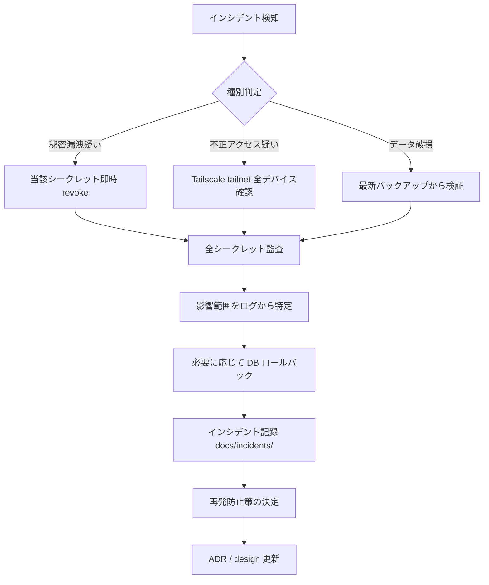

# セキュリティモデル詳細設計

## 1. 概要

本ドキュメントは、個人向け資産・家計管理アプリケーションのセキュリティ設計を示す。概要設計 §10 を土台とし、脅威モデル、チェックリスト、認証情報取扱マトリクス、Docker secret運用、ローテーション、インシデント対応、監査ログ、バックアップ暗号化を実装可能なレベルで定義する。

設計原則:
- **認証情報非保持**（ADR-011）: 金融機関のログインID/PWは一切保持しない
- **外部非公開**（ADR-010）: Web UIはTailscaleオーバーレイネットワーク経由のみ
- **データ主権**: 第三者サービス（MoneyForward等）にデータを預けない
- **最小権限**: コンテナ・ネットワーク・APIスコープすべてで最小権限を徹底

## 2. 脅威モデル

| ID | 脅威 | 影響 | 発生可能性 | 対策 |
|---|---|---|---|---|
| T-1 | NAS自体への物理アクセス（盗難・侵入） | 全データ漏洩 | 低 | フルディスク暗号化、強パスワード、施錠 |
| T-2 | 家庭内Wi-Fi経由の侵入 | 設定改竄、データ漏洩 | 中 | UPnP無効、Tailscale限定、SSH鍵認証 |
| T-3 | 家族メンバーの誤操作 | データ削除・改竄 | 中 | バックアップ3階層、アクセス分離 |
| T-4 | 依存パッケージの脆弱性 | RCE等 | 中 | Dependabot、定期アップデート |
| T-5 | 誤コミットでの秘密漏洩 | API key流出 | 中 | `.gitignore`徹底、git-secrets、secret scanning |
| T-6 | バックアップ媒体の紛失 | データ漏洩 | 低 | age暗号化必須、秘密鍵分離保管 |
| T-7 | クラウドストレージ事業者の侵害 | バックアップ漏洩 | 低 | age暗号化（事業者は復号不可） |
| T-8 | Anthropic API レスポンスでの情報漏洩 | 取引摘要が学習データに含まれるリスク | 中 | API利用規約確認、PII削除、必要最小限のみ送信 |
| T-9 | Gmail OAuth トークンの悪用 | メール読み取り権限の濫用 | 低 | スコープを `gmail.readonly` のみに限定、定期失効 |
| T-10 | PayPal API Secret の悪用 | アカウント情報の取得 | 低 | 読み取りスコープのみ、サンドボックス→本番分離 |
| T-11 | UIへの不正アクセス | 全データ閲覧 | 低 | Tailscale認証、Caddy 自己署名証明書 |
| T-12 | DBの直接公開 | 全データ漏洩 | 低 | `internal: true` ネットワーク、ポート非公開 |

## 3. セキュリティチェックリスト

リリース前および定期点検（四半期）で確認する。

- [ ] NAS自体のフルディスク暗号化が有効
- [ ] 共有フォルダ単位の暗号化（Synology Encrypted Shared Folder等）
- [ ] PostgreSQL は外部ネットワークに露出していない（`internal: true`）
- [ ] UI公開はTailscale経由のみ
- [ ] Caddy のポート443はlocalhostバインドのみ
- [ ] バックアップファイルは age で暗号化されてから外部保管
- [ ] PayPal API SecretはDocker secret経由のみ。コード/Gitに絶対残さない
- [ ] Gmail OAuthトークンも同様にDocker secretで管理
- [ ] Anthropic API Key も Docker secret 経由
- [ ] 口座番号は平文保存していない（マスク or 暗号化）
- [ ] `.gitignore` に `secrets/` と `*.env` が含まれている
- [ ] git pre-commit hook で git-secrets / detect-secrets が動作
- [ ] 全コンテナで `restart: unless-stopped`
- [ ] SSH は鍵認証のみ、パスワード認証無効
- [ ] NASのDSM管理画面はlocalhostまたはTailscale経由のみ
- [ ] バックアップのリストアドリルを年1回以上実施
- [ ] 依存パッケージの脆弱性スキャン（pip-audit / npm audit）月次
- [ ] age 秘密鍵の物理バックアップ（紙メモ + 金庫）

## 4. 認証情報取扱マトリクス

| 認証情報 | 保管場所 | スコープ | ローテーション頻度 | 漏洩時対応 |
|---|---|---|---|---|
| 銀行・証券のログインID/PW | **保持しない** | - | - | - |
| Gmail OAuth Token | Docker secret (`gmail_oauth_token.json`) | `gmail.readonly` | 6ヶ月 | Google アカウントから revoke → 再OAuth |
| PayPal Client ID | Docker secret | Read-only Transactions | 6ヶ月 | PayPal Developer Dashboard で再発行 |
| PayPal Secret | Docker secret | Read-only Transactions | 6ヶ月 | 同上 |
| Anthropic API Key | Docker secret | プロジェクト単位 | 6ヶ月 | Anthropic Console から revoke + 新規発行 |
| PostgreSQL Password | Docker secret | DB アクセス | 12ヶ月 | DBパスワード変更 + secret 更新 |
| age 秘密鍵 | NAS外（紙メモ + 物理金庫） | バックアップ復号 | 不変（紛失時のみ再生成） | バックアップを再暗号化 |
| Tailscale 認証 | 各端末 OS Keychain | tailnet メンバ | デバイス単位で管理 | デバイスを admin console から削除 |

## 5. Docker secret 運用

### 5.1 ファイル配置

```
/volume1/docker/kakeibo/secrets/
├── pg_password.txt              # 0600
├── anthropic_key.txt            # 0600
├── gmail_oauth_token.json       # 0600
└── paypal_api_secret.txt        # 0600
```

ファイル権限はオーナー読みのみ（`chmod 600`）。`secrets/` ディレクトリ自体も `chmod 700`。

### 5.2 .gitignore

```
secrets/
*.env
*.pem
*.age
```

リポジトリには `secrets/.gitkeep` のみコミット。実体は手動配置。

### 5.3 起動時の検証

`docker compose up` 前に以下を確認するスクリプト:

```bash
#!/bin/bash
# scripts/check_secrets.sh
SECRETS_DIR=./secrets
required=("pg_password.txt" "anthropic_key.txt" "gmail_oauth_token.json" "paypal_api_secret.txt")

for f in "${required[@]}"; do
  path="$SECRETS_DIR/$f"
  if [ ! -f "$path" ]; then
    echo "ERROR: $path not found"
    exit 1
  fi
  perm=$(stat -c '%a' "$path")
  if [ "$perm" != "600" ]; then
    echo "ERROR: $path permission is $perm, expected 600"
    exit 1
  fi
done
echo "All secrets OK"
```

## 6. シークレットローテーション

### 6.1 標準ローテーション手順（6ヶ月毎）

例: Anthropic API Key

```bash
# 1. 新キーを発行（Anthropic Console）
NEW_KEY="sk-ant-api03-xxxx"

# 2. 一時的に新旧両方を保持（旧キーがあれば変数で参照）
echo "$NEW_KEY" > ./secrets/anthropic_key.txt.new
chmod 600 ./secrets/anthropic_key.txt.new

# 3. アトミックに差し替え
mv ./secrets/anthropic_key.txt.new ./secrets/anthropic_key.txt

# 4. コンテナ再起動（secret は volume mount なので再読み込みのため再起動必要）
docker compose restart worker api

# 5. 動作確認後、旧キーを Anthropic Console から revoke
```

### 6.2 緊急ローテーション

漏洩疑いが発覚した場合、即時に上記手順を実行し、漏洩キーを revoke する。手順を `runbooks/secret_rotation.md` に整備（将来）。

## 7. インシデント対応フロー



### 7.1 検知ソース

- Docker logs に warning/error が頻発
- バックアップ失敗のメール通知
- Tailscale admin console で見覚えのないデバイス
- API利用ログでの異常リクエスト数
- 外部からの脆弱性報告（極稀）

## 8. 監査ログ

家庭利用の範囲では本格的な SIEM は導入しない。最小限のログのみ:

| ログ種別 | 出力先 | 保持期間 |
|---|---|---|
| `transactions.imported_at` | DB | 永続 |
| Worker取込ログ | `docker compose logs worker` | 30日（journald） |
| API アクセスログ | Caddy stdout → docker logs | 30日 |
| ルール変更履歴 | `categorization_rules.updated_at` + 別途 audit table（将来） | 永続 |
| シークレット変更 | 手動運用ノート（紙 or プライベートwiki） | 永続 |

audit table は将来追加検討（誰がいつどのレコードを編集したかを `transaction_id, before_json, after_json, changed_at` で記録）。

## 9. バックアップ暗号化（age）

### 9.1 鍵生成

```bash
age-keygen -o ~/.age/key.txt
chmod 600 ~/.age/key.txt
# 公開鍵を別ファイルに
grep "public key" ~/.age/key.txt | awk '{print $NF}' > /volume1/secrets/age_recipient.txt
```

### 9.2 暗号化（バックアップスクリプト内）

`docs/design/04-deployment-stack.md` §8.3 と同じ:

```bash
age -r $(cat /volume1/secrets/age_recipient.txt) -o backup.tar.gz.age backup.tar.gz
```

### 9.3 秘密鍵の保管

| 保管場所 | 内容 | リカバリ用途 |
|---|---|---|
| NAS内 `~/.age/key.txt` | 普段使用する鍵 | 通常リストア時 |
| 紙メモ（金庫） | 公開鍵 + 秘密鍵 | NAS全損時の最終手段 |
| 信頼できる第三者（家族）への封筒 | 同上 | 本人が事故等で復旧不可時 |

## 10. PII / センシティブデータの取扱

### 10.1 LLM への送信前マスキング

Anthropic API へ取引データを送る際、以下をマスクまたは除外:
- 口座番号（既にマスク済みのはずだが二重チェック）
- 個人名がそのまま摘要に入っている場合（家族間振込等）

```python
def sanitize_for_llm(tx: Transaction) -> dict:
    return {
        "id": tx.id,
        "occurred_on": tx.occurred_on.isoformat(),
        "amount": str(tx.amount),
        "description": mask_pii(tx.description),
        "counterparty": mask_pii(tx.counterparty or ""),
    }
```

`mask_pii` は正規表現で氏名らしき文字列を `***` に置換するヒューリスティック。完璧ではないが、未対策よりはるかに良い。

### 10.2 ログへの出力禁止

- ログに `raw_payload` 全体を出力しない（機密含む可能性）
- エラー時は `transaction_id` のみ記録
- スタックトレース内の変数値は要注意

## 11. 既知の課題・申し送り

- WAF（Caddy plugins等）は導入しない。Tailscale限定で十分と判断。
- 二要素認証（UI上のログイン）は単独ユーザのため不要。Tailscaleの認証で代替。
- 量子耐性暗号は現時点では考慮外（age が対応した時点で移行検討）。
- audit log テーブルは Phase 4 以降で追加検討。
- Anthropic API のリージョン・データ保持ポリシー変更時は再評価。
