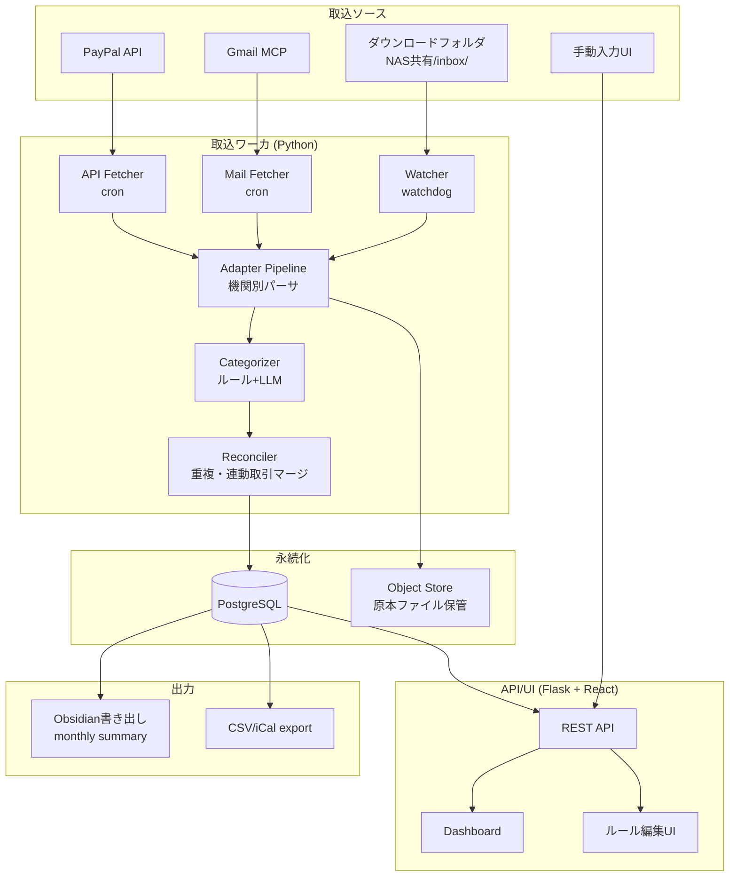
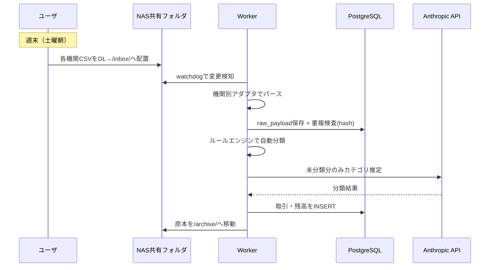
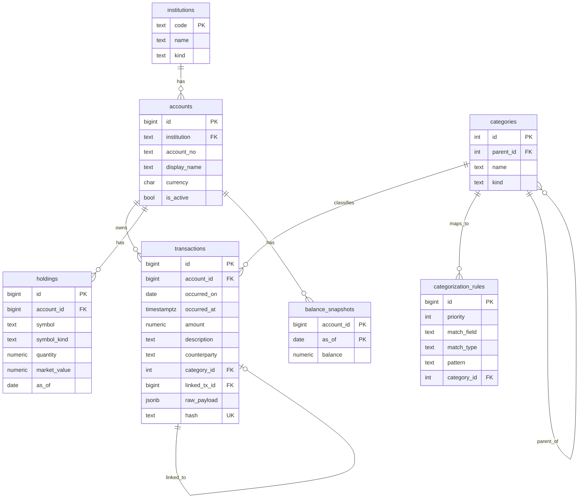
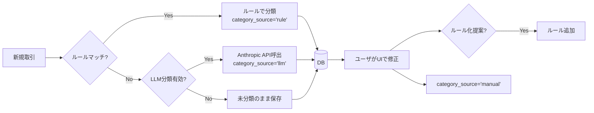
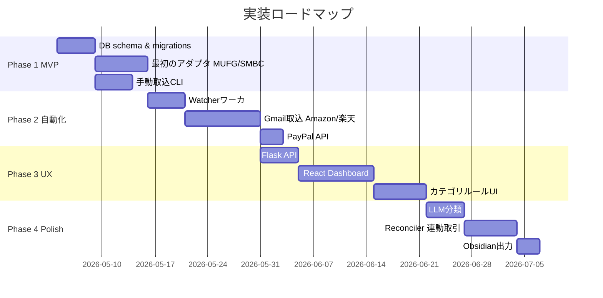

# 個人向け資産・家計管理アプリケーション 設計書

## 目次

1. [プロジェクト概要](#1-プロジェクト概要)
2. [設計判断の前提](#2-設計判断の前提)
3. [システムアーキテクチャ](#3-システムアーキテクチャ)
4. [データモデル](#4-データモデル)
5. [機関別取得方法](#5-機関別取得方法)
6. [カテゴリ分類戦略](#6-カテゴリ分類戦略)
7. [デプロイ構成](#7-デプロイ構成)
8. [実装ロードマップ](#8-実装ロードマップ)
9. [運用](#9-運用)
10. [セキュリティ](#10-セキュリティ)
11. [今後の拡張余地](#11-今後の拡張余地)

---

## 1. プロジェクト概要

### 1.1 目的

個人利用を前提とした資産集約・家計管理アプリケーションを自宅NAS上に構築する。MoneyForward等の商用サービスへ依存せず、自分自身でデータの主権を持つ。両用途（資産推移の可視化 + 支出のカテゴリ別分析）に対応する。

### 1.2 想定ユーザ

- 単独ユーザ（開発者本人）
- マルチテナント不要

### 1.3 対象機関

| 区分 | 機関名 |
|---|---|
| 銀行 | 三菱UFJ銀行 / 三井住友銀行 / 三井住友信託銀行 |
| 証券・投信 | ひふみ投信 / 楽天証券 / SMBC日興証券 |
| EC | Amazon / 楽天市場 / Yahoo!ショッピング |
| 決済 | PayPay / PayPal |

### 1.4 ゴール

- **残高鮮度**: 週次（毎週末バッチ取り込み）
- **取引補足**: メール起点でリアルタイム性を確保
- **可視化**: 月次推移、カテゴリ別支出、ポートフォリオ構成

---

## 2. 設計判断の前提

### 2.1 法務・規制面の制約

個人開発者が銀行のオープンAPIに直接接続することは事実上不可能。日本の銀行APIは「電子決済等代行業者（金融庁登録事業者）」との契約に基づいて提供される枠組みであり、MoneyForwardやZaim等はこの登録業者に該当する。

EC側（Amazon/楽天/Yahoo!ショッピング/PayPay）は利用規約でスクレイピング・自動アクセスを明示的に禁止している。PayPalのみ個人開発者向けの公式APIが利用可能。

→ **本設計では、ToSに抵触しない方式（公式エクスポート + 公式API + メール通知）のみを採用する。**

### 2.2 技術的現実

スクレイピング方式は以下の理由で採用しない：

| 障壁 | 影響度 |
|---|---|
| 多要素認証（SMS OTP / トークン / 生体）の必須化 | 完全自動化が極めて困難 |
| デバイスフィンガープリンティング | 新環境からのログインで追加認証 |
| CAPTCHA / 行動分析 | 特に大手ECで厳格 |
| サイト構造の頻繁な変更 | 継続的な保守工数 |
| ログイン試行のロックアウト | 解除が電話手続きとなる事故リスク |

### 2.3 セキュリティ前提

- 認証情報を**保持しない**設計を採る（CSVドロップ + 公式OAuthのみ）
- データベース自体を保護対象資産として扱う（フルディスク暗号化、バックアップ暗号化）
- Web UIは外部公開しない（Tailscale等のオーバーレイネットワーク経由のみ）

### 2.4 採用方針

**ハイブリッド方式**を採用する。

| 取得方式 | 適用対象 | 自動化レベル |
|---|---|---|
| 公式CSV/PDFの週次手動DL | 銀行・証券各社 | 半自動（DLは手動、パースは自動） |
| メール通知パース（Gmail MCP経由） | EC各社、銀行の入出金通知 | 自動（日次バッチ） |
| 公式API | PayPal | 自動 |
| 手動入力UI | 現金、その他補完 | 手動 |

---

## 3. システムアーキテクチャ

### 3.1 全体構成



### 3.2 レイヤ構成

| レイヤ | 役割 | 主要技術 |
|---|---|---|
| 取込層 | ファイル監視、API/メール取得、原本保管 | Python + watchdog + cron |
| 正規化層 | 機関別アダプタ、共通スキーマ変換 | Python（アダプタパターン） |
| 永続化層 | 構造化データ + 原本保管 | PostgreSQL 16 + ローカルObject Store |
| 提供層 | REST API、ダッシュボード | Flask + React |
| 出力層 | Obsidian連携、CSV/iCalエクスポート | Pythonバッチ |

### 3.3 取り込みフロー



---

## 4. データモデル

### 4.1 ER図



### 4.2 DDL

```sql
-- =========== 機関・口座マスタ ===========
CREATE TABLE institutions (
  code        TEXT PRIMARY KEY,
  name        TEXT NOT NULL,
  kind        TEXT NOT NULL CHECK (kind IN ('bank','securities','fund','ec','wallet'))
);

CREATE TABLE accounts (
  id              BIGSERIAL PRIMARY KEY,
  institution     TEXT NOT NULL REFERENCES institutions(code),
  account_no      TEXT NOT NULL,
  display_name    TEXT NOT NULL,
  currency        CHAR(3) NOT NULL DEFAULT 'JPY',
  is_active       BOOLEAN NOT NULL DEFAULT TRUE,
  UNIQUE (institution, account_no)
);

-- =========== ディメンション: カテゴリ ===========
CREATE TABLE categories (
  id        SERIAL PRIMARY KEY,
  parent_id INT REFERENCES categories(id),
  name      TEXT NOT NULL,
  kind      TEXT NOT NULL CHECK (kind IN ('expense','income','transfer','investment'))
);

-- =========== フロー: 取引 ===========
CREATE TABLE transactions (
  id              BIGSERIAL PRIMARY KEY,
  account_id      BIGINT NOT NULL REFERENCES accounts(id),
  occurred_on     DATE NOT NULL,
  occurred_at     TIMESTAMPTZ,
  amount          NUMERIC(18,4) NOT NULL,        -- 入金正、出金負
  currency        CHAR(3) NOT NULL DEFAULT 'JPY',
  description     TEXT NOT NULL,
  counterparty    TEXT,
  category_id     INT REFERENCES categories(id),
  category_source TEXT CHECK (category_source IN ('rule','llm','manual')),
  linked_tx_id    BIGINT REFERENCES transactions(id),
  raw_payload     JSONB NOT NULL,
  source_file     TEXT,
  imported_at     TIMESTAMPTZ NOT NULL DEFAULT NOW(),
  hash            TEXT NOT NULL UNIQUE
);
CREATE INDEX ON transactions (account_id, occurred_on);
CREATE INDEX ON transactions (category_id, occurred_on);

-- =========== ストック: 保有資産スナップショット ===========
CREATE TABLE holdings (
  id              BIGSERIAL PRIMARY KEY,
  account_id      BIGINT NOT NULL REFERENCES accounts(id),
  symbol          TEXT NOT NULL,                  -- 'JPY-CASH', '7203.T', 'ひふみプラス' 等
  symbol_kind     TEXT NOT NULL,                  -- 'cash','stock','fund','crypto'
  quantity        NUMERIC(18,6) NOT NULL,
  market_value    NUMERIC(18,4),
  unit_cost       NUMERIC(18,6),
  as_of           DATE NOT NULL,
  raw_payload     JSONB NOT NULL,
  UNIQUE (account_id, symbol, as_of)
);

CREATE TABLE balance_snapshots (
  account_id      BIGINT NOT NULL REFERENCES accounts(id),
  as_of           DATE NOT NULL,
  balance         NUMERIC(18,4) NOT NULL,
  PRIMARY KEY (account_id, as_of)
);

-- =========== ルール: 自動分類用 ===========
CREATE TABLE categorization_rules (
  id          BIGSERIAL PRIMARY KEY,
  priority    INT NOT NULL DEFAULT 100,
  match_field TEXT NOT NULL,                       -- 'description','counterparty'
  match_type  TEXT NOT NULL CHECK (match_type IN ('regex','contains','exact')),
  pattern     TEXT NOT NULL,
  category_id INT NOT NULL REFERENCES categories(id),
  is_active   BOOLEAN NOT NULL DEFAULT TRUE
);
```

### 4.3 設計上の要点

| 項目 | 設計判断 | 理由 |
|---|---|---|
| `raw_payload` JSONB | 元データを保持 | パーサ改修時に再変換可能（データレイク的発想） |
| `hash` UNIQUE | `(account_id, occurred_on, amount, description)` のSHA256 | 再取り込みの冪等性保証 |
| `linked_tx_id` | 自己参照 | カード利用→銀行引落の連動取引を後付けでリンク |
| `amount` NUMERIC | float禁止 | 投資信託の口数等で丸め誤差が致命的になる |
| `holdings` と `balance_snapshots` の併存 | 二重持ち | 整合性チェックに使える |
| `category_source` | 'rule'/'llm'/'manual' | 信頼度の異なる分類を区別、再学習対象を特定可能に |

---

## 5. 機関別取得方法

### 5.1 マッピング表

| 機関 | 方式 | 原本フォーマット | 頻度 | 留意点 |
|---|---|---|---|---|
| 三菱UFJ銀行 | CSV手動DL | Shift_JIS CSV | 週次 | ダイレクトの保存期間が短い。月初に必須DL |
| 三井住友銀行 | CSV手動DL | CSV | 週次 | 同上 |
| 三井住友信託銀行 | CSV手動DL | CSV | 月次 | 履歴保持期間に注意 |
| ひふみ投信 | PDF月次レポート + 取引履歴CSV | PDF + CSV | 月次 | 残高はPDFから抽出（pypdf） |
| 楽天証券 | CSV手動DL | CSV | 週次 | 投資信託・株式・米国株で別画面 |
| SMBC日興証券 | CSV手動DL | CSV | 月次 | 日興イージートレード |
| Amazon | 注文確認メール | HTML/Plain | リアルタイム | Gmail MCP経由 |
| 楽天市場 | 注文確認メール | HTML | リアルタイム | 同上 |
| Yahoo!ショッピング | 注文確認メール | HTML | リアルタイム | 同上 |
| PayPay | アプリのCSV出力 | CSV | 月次 | アプリから出力 → NAS共有 |
| PayPal | 公式API（Transactions API v1） | JSON | 自動（日次） | OAuth、Developer Dashboard |

### 5.2 アダプタパターン

すべての取込ロジックは `IngestAdapter` インターフェースに統一する。

```python
# adapters/base.py
from abc import ABC, abstractmethod
from typing import Iterable
from .types import Transaction, Holding

class IngestAdapter(ABC):
    source: str  # 機関コード

    @abstractmethod
    def parse(self, payload) -> Iterable[Transaction]:
        """payload はファイルパス、JSON、メール本文などソースに応じて型が変わる"""
        ...

    @abstractmethod
    def extract_holdings(self, payload) -> Iterable[Holding]:
        """残高/保有資産が取得可能なソースのみ実装"""
        ...

# adapters/mufg.py
class MufgCsvAdapter(IngestAdapter):
    source = "mufg"

    def parse(self, csv_path):
        # 三菱UFJのCSV: Shift_JIS / 日付・摘要・お支払金額・お預り金額・残高
        ...
```

各機関で1ファイル。テストはサンプルCSVを `tests/fixtures/` に配置してゴールデンマスタテストを実装する。

---

## 6. カテゴリ分類戦略

### 6.1 3層構造

支出分析を実用にするには80%以上の自動分類精度が必要。3層で達成する。



### 6.2 ルールエンジン

シンプルなregex / contains / exact マッチのみ。最初に手動で100件程度のルールを書けば9割をカバーできる（食費・交通費・固定費は反復性が高いため）。

優先度順に評価し、最初にマッチしたものを採用する。

### 6.3 LLM分類

ルール未マッチ取引のみAnthropic APIへ送信。月数百件レベルなのでコストは無視できる範囲。プロンプトで「日本の家計簿カテゴリ」を明示し、確信度が低い場合は未分類のまま残す。

### 6.4 半自動学習

ユーザがUI上で分類を修正した際、「このパターンを今後XXカテゴリに分類しますか？」と提案してルール化する。MoneyForwardが内部で行っている挙動と同等。

---

## 7. デプロイ構成

### 7.1 Docker Composeスタック

```yaml
# /volume1/docker/kakeibo/docker-compose.yml
services:
  postgres:
    image: postgres:16-alpine
    environment:
      POSTGRES_DB: kakeibo
      POSTGRES_USER: kakeibo
      POSTGRES_PASSWORD_FILE: /run/secrets/pg_password
    volumes:
      - ./data/pg:/var/lib/postgresql/data
      - ./backup:/backup
    secrets:
      - pg_password
    networks: [internal]

  api:
    build: ./api
    depends_on: [postgres]
    environment:
      DATABASE_URL: postgresql://kakeibo@postgres:5432/kakeibo
      ANTHROPIC_API_KEY_FILE: /run/secrets/anthropic_key
    secrets:
      - anthropic_key
    networks: [internal, external]

  worker:
    build: ./worker
    depends_on: [postgres]
    volumes:
      - ./inbox:/inbox:rw
      - ./archive:/archive:rw
    environment:
      DATABASE_URL: postgresql://kakeibo@postgres:5432/kakeibo
      INBOX_PATH: /inbox
    networks: [internal]

  ui:
    build: ./ui
    depends_on: [api]
    networks: [external]

  caddy:
    image: caddy:2-alpine
    volumes:
      - ./Caddyfile:/etc/caddy/Caddyfile
      - ./caddy_data:/data
    networks: [external]
    ports: ["443:443"]

  backup:
    image: postgres:16-alpine
    volumes:
      - ./backup:/backup
    command: >
      sh -c "while true; do
        PGPASSWORD=$$(cat /run/secrets/pg_password)
        pg_dump -h postgres -U kakeibo kakeibo | gzip > /backup/$$(date +%Y%m%d).sql.gz;
        find /backup -name '*.sql.gz' -mtime +30 -delete;
        sleep 86400;
      done"
    secrets:
      - pg_password
    depends_on: [postgres]
    networks: [internal]

networks:
  internal:
  external:

secrets:
  pg_password:
    file: ./secrets/pg_password.txt
  anthropic_key:
    file: ./secrets/anthropic_key.txt
```

### 7.2 ネットワーク方針

- `internal`: Postgres + worker + 内部API通信専用。外部ポート開放なし
- `external`: UIアクセス用
- 外部公開はTailscale経由のみ（Funnel/Serveでユーザ自身のみアクセス可）
- Cloudflare Tunnelも代替候補

### 7.3 バックアップ戦略

| 階層 | 内容 | 保持期間 |
|---|---|---|
| 一次 | `backup` コンテナによる日次pg_dump → gzip | 30日 |
| 二次 | NAS別ボリュームへrsync | 90日 |
| 三次 | 暗号化（age）して外部ストレージ（B2/S3）へアップロード | 1年 |

原本ファイル（`/archive`）も同様にバックアップ対象とする。

---

## 8. 実装ロードマップ



### Phase別ゴール

| Phase | ゴール |
|---|---|
| Phase 1 MVP | MUFG/SMBCのCSVをCLIから取込み、PostgresにINSERT。SQLで月次サマリが出る状態 |
| Phase 2 自動化 | Watcherがファイル投下を検知して自動取込。Gmail経由でEC通知も取込 |
| Phase 3 UX | React Dashboardで残高推移・カテゴリ別支出を可視化。ルール編集UI |
| Phase 4 Polish | LLM分類、連動取引マージ、Obsidian出力で日常運用に統合 |

---

## 9. 運用

### 9.1 週次オペレーション

土曜朝（30分以内を想定）：

1. 各銀行・証券のWebサイトにログインし、CSVをダウンロード
2. NAS共有フォルダ `/inbox/{機関コード}/` に配置
3. Watcherが自動取込
4. ダッシュボードで取込結果を確認
5. 未分類取引があれば手動分類

### 9.2 月次オペレーション

- ひふみ投信のPDF月次レポート取込
- SMBC日興証券のCSV取込
- PayPayアプリからCSV出力
- 残高整合性レポートの確認

### 9.3 出力検証ポイント

| チェック | 内容 |
|---|---|
| 冪等性 | 同じCSVを2回取込んでも重複しない（hash UNIQUE制約） |
| 残高整合性 | `前日残高 + 当日取引合計 = 当日残高` のassertion |
| 時刻ゾーン | DB保存はUTC、表示はAsia/Tokyoで一貫 |
| 金額精度 | 必ずNUMERIC使用 |
| 文字コード | MUFG等はShift_JIS。読み込み時に明示指定 |

---

## 10. セキュリティ

### 10.1 セキュリティチェックリスト

- [ ] NAS自体のフルディスク暗号化（共有フォルダ単位の暗号化推奨）
- [ ] PostgreSQLは外部ネットワークに露出させない（`internal` networkのみ）
- [ ] UI公開はTailscale経由のみ。Caddyに対するパブリックアクセスは禁止
- [ ] バックアップファイルはage/gpgで暗号化してから外部保管
- [ ] PayPal API SecretはDocker secret経由のみ。コード/Gitに絶対残さない
- [ ] Gmail OAuthトークンも同様にDocker secretで管理
- [ ] 口座番号はDB保存時にハッシュ化または暗号化を検討

### 10.2 認証情報の取り扱い

本設計では**金融機関のログイン認証情報を一切保持しない**。これは設計上の最重要事項である。

| 認証情報 | 保管場所 | 理由 |
|---|---|---|
| 銀行・証券のログインID/PW | **保持しない** | 手動DL方式のため不要 |
| Gmail OAuthトークン | Docker secret | 読み取り専用スコープに限定 |
| PayPal API Secret | Docker secret | サンドボックス→本番で別キー |
| Anthropic API Key | Docker secret | プロジェクト単位で発行 |

### 10.3 脅威モデル

想定脅威と対策：

| 脅威 | 対策 |
|---|---|
| NAS自体への物理アクセス | フルディスク暗号化 + 強パスワード |
| ネットワーク経由の侵入 | UPnP無効化、Tailscaleのみ、SSH鍵認証 |
| アプリ層の脆弱性 | 依存関係の定期アップデート、Dependabot |
| 誤ったコミットでの秘密漏洩 | git-secretsプリコミットフック、Docker secret使用 |
| バックアップ媒体の紛失 | age暗号化必須 |

---

## 11. 今後の拡張余地

優先度低、将来検討。

- **iCalendarエクスポート**: 大型支出をカレンダーに連携
- **予算機能**: カテゴリ別月次予算設定とアラート
- **マルチ通貨対応**: 海外資産保有時のJPY換算自動化
- **資産配分の自動バランシング推奨**
- **税務連携**: 確定申告用のCSV出力フォーマット
- **共有機能**: 配偶者など信頼できる第三者との読み取り専用共有

---

## 付録A: 用語集

| 用語 | 定義 |
|---|---|
| アダプタ | 機関別の取込ロジックを担うクラス。`IngestAdapter` インターフェースを実装 |
| ストック | ある時点の残高・保有量。`holdings`, `balance_snapshots` |
| フロー | 期間内の取引。`transactions` |
| ゴールデンマスタテスト | 既知の入力に対する既知の正解出力を保持し、リグレッション検出を行うテスト手法 |
| 連動取引 | カード利用と引き落としなど、論理的に同一の取引が複数機関に現れるケース |

## 付録B: 参考資料

- 全国銀行協会「オープンAPIって何？」: https://www.zenginkyo.or.jp/article/tag-g/9797/
- 三菱UFJ銀行「電子決済等代行業者との契約内容」: https://www.bk.mufg.jp/ippan/law/dendaigyousha/keiyaku.html
- PayPal Developer Documentation - Transactions API
