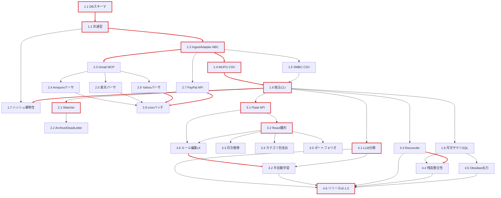

# 個人向け資産・家計管理アプリケーション 開発プラン

## 1. 概要

### 1.1 本プランの位置付け

本ドキュメントは `docs/plans/00-initial-design.md`（初期設計書 v1.0）の §8 実装ロードマップを、**実行可能なタスク単位**に展開した本体プランである。設計書がアーキテクチャ判断・データモデル・取得方式の合意事項を保持するのに対し、本プランは「次に何を、どのブランチで、どのADR/designに紐づけて実装するか」を一意に決める作業計画として機能する。

### 1.2 スコープ

- Phase 1〜4 の各タスクを 1〜3 日粒度で分解
- 各タスクに ADR / design 文書 / ブランチ名 / 受入基準 / 依存関係を明記
- TDD（t-wada方式）と agent-rules/00-core-principles.md の開発サイクル順序を前提とする手順書

### 1.3 非スコープ

- 設計判断そのものの再議論（変更が必要な場合は ADR を新規発番してから本プランを改版）
- 実装コードの詳細仕様（design/01〜08 を参照）
- 運用手順の網羅（設計書 §9 を参照）

### 1.4 改版方針

- ADR 追加・design 改訂のたびに `last_updated` を更新する
- Phase 完了時に該当タスクを `[x]` でマークし、振り返りを「リスクと未決事項」へ反映する

---

## 2. 開発原則

詳細は agent-rules を参照。本プランで前提とする要点のみ列挙する。

| 原則 | 参照 | 要点 |
|---|---|---|
| TDD（t-wada方式） | `agent-rules/00-core-principles.md`, `agent-rules/11-testing-strategy.md` | Red → Green → Refactor。実装ファースト禁止 |
| 開発サイクル順序 | `agent-rules/00-core-principles.md` | ブランチ作成 → ADR/設計更新 → テスト → 実装 → コミット → 品質チェック |
| アトミックコミット | `agent-rules/10-git-strategy.md` | 1コミット=1論理変更。`機能:`/`修正:`/`テスト:` 等で日本語1〜2文 |
| ブランチ運用 | `agent-rules/10-git-strategy.md` | `feature/<task-name>` を develop から分岐。main / develop へ直接コミット禁止 |
| 日本語使用 | `agent-rules/00-core-principles.md` | コメント・テスト記述・コミットメッセージはすべて日本語 |
| ドキュメント管理 | `agent-rules/30-documentation-management.md` | 設計変更前に必ず ADR を更新 |

各タスク着手時のチェックリスト：

1. `git checkout develop && git pull origin develop` で起点を最新化
2. `feature/<task-name>` を作成
3. 関連 ADR / design を Read（場合により改版）
4. テストを先に書く（Red）
5. 最小実装で通す（Green）
6. リファクタ（Refactor）
7. アトミックコミット
8. `pytest` / `pyright` / `lint` の品質ゲートをパス
9. develop へマージ

---

## 3. マイルストーン

設計書 §8 の Gantt を実行可能なゴール条件へ翻訳したもの。Phase 完了は **すべての受入基準が真** で判定する。

### 3.1 Phase 1: MVP（〜2週間目安）

| 項目 | 内容 |
|---|---|
| ゴール | MUFG / SMBC の CSV を CLI から取込み、PostgreSQL に正規化済み取引が格納される。SQL で月次サマリが手計算と一致する |
| 完了条件 | (a) Alembic migration が冪等に実行できる<br>(b) 同一 CSV を 2 回投入しても `transactions` 行数が増えない<br>(c) サンプル CSV から月次合計を集計する SQL が手計算結果と一致する<br>(d) 全ユニットテストが緑、`pyright` クリーン |
| 関連 ADR | ADR-001, ADR-002, ADR-004, ADR-005, ADR-006, ADR-007 |
| 関連 design | design/01-data-model, design/02-ingest-adapters, design/08-ingest-flow |

### 3.2 Phase 2: 自動化（〜1か月目安）

| 項目 | 内容 |
|---|---|
| ゴール | `/inbox` への CSV 投下 → 5 分以内に DB 反映。Gmail 経由で EC 注文確認メールが自動取込。PayPal API から日次取引が同期 |
| 完了条件 | (a) Watcher が起動状態で CSV 投下から 5 分以内に取引が DB に現れる<br>(b) Amazon / 楽天市場 / Yahoo!ショッピングのサンプルメールから取引が抽出される<br>(c) PayPal Sandbox API から取引が取得できる<br>(d) パース失敗ファイルが dead letter ディレクトリに移動される<br>(e) 統合テスト（実 Postgres + 模擬メール）が緑 |
| 関連 ADR | ADR-003, ADR-007, ADR-009, ADR-011 |
| 関連 design | design/02-ingest-adapters, design/05-security-model, design/08-ingest-flow |

### 3.3 Phase 3: UX（〜1.5か月目安）

| 項目 | 内容 |
|---|---|
| ゴール | React Dashboard で残高推移・カテゴリ別支出・ポートフォリオ構成が可視化され、UI からカテゴリルールを編集できる |
| 完了条件 | (a) Flask REST API が残高 / 取引 / カテゴリ / ルール のCRUDを提供する<br>(b) UI で月次推移グラフ・カテゴリ別支出・保有資産が表示される<br>(c) UI からルール追加・更新・削除が可能<br>(d) Playwright e2e で主要シナリオが緑<br>(e) `tsc --strict` クリーン |
| 関連 ADR | ADR-009, ADR-010 |
| 関連 design | design/04-deployment-stack, design/05-security-model |

### 3.4 Phase 4: Polish（〜2か月目安）

| 項目 | 内容 |
|---|---|
| ゴール | LLM 分類・連動取引マージ・残高整合性チェック・Obsidian 出力が運用に統合され、v0.1.0 タグでリリースされる |
| 完了条件 | (a) ルール未マッチ取引の 80% 以上が LLM 分類で確信度しきい値を超える<br>(b) UI 修正→ルール提案フローが動作する<br>(c) Reconciler でカード利用と引落が `linked_tx_id` で結合される<br>(d) `前日残高 + 当日取引合計 = 当日残高` が全口座で成立する<br>(e) Obsidian Vault に月次サマリ Markdown が出力される<br>(f) 1か月分のリアルデータでリグレッションなし |
| 関連 ADR | ADR-008, ADR-012 |
| 関連 design | design/03-categorization-engine, design/06-reconciler, design/07-output-integrations |

---

## 4. タスク詳細（Phase別）

各タスク粒度は **1〜3 日で完了する単位**。表形式の必須項目は `目的 / 関連ADR / 関連design / ブランチ / 受入基準 / TDDアプローチ / 依存`。

### 4.1 Phase 1: MVP

#### Phase 1.1 DBスキーマ・マイグレーション基盤

| 項目 | 内容 |
|---|---|
| 目的 | 初期設計書 §4.2 DDL を Alembic マイグレーションへ落とし込み、冪等に適用できる基盤を整える |
| 関連 ADR | ADR-004（PostgreSQL 16 + JSONB）, ADR-005（NUMERIC型採用）, ADR-006（hash UNIQUE） |
| 関連 design | design/01-data-model |
| ブランチ | `feature/db-schema-initial` |
| 受入基準 | - `alembic upgrade head` が 2 回連続で成功する（冪等）<br>- `pytest` で全テーブル・全制約の存在検証が緑<br>- `amount` に文字列・NaN を投入すると CHECK / 型エラーで弾かれる<br>- `transactions.hash` への重複 INSERT が UNIQUE 違反になる |
| TDDアプローチ | テスト先行: マイグレーション適用後に `information_schema` を読み出し、期待スキーマと一致するかを検証 / 制約違反時に期待例外が発生するかを検証 |
| 依存 | なし（最初のタスク） |

補足: マイグレーション粒度は「institutions / accounts」「categories」「transactions」「holdings / balance_snapshots」「categorization_rules」の 5 つに分割し、各ファイルを別コミットにする。

#### Phase 1.2 共通型（Transaction / Holding / BalanceSnapshot）

| 項目 | 内容 |
|---|---|
| 目的 | 各アダプタが返す正規化済みドメインオブジェクトを `dataclass` (or pydantic) で定義し、型レベルで共通化する |
| 関連 ADR | ADR-005, ADR-007 |
| 関連 design | design/01-data-model, design/02-ingest-adapters |
| ブランチ | `feature/domain-types` |
| 受入基準 | - `Transaction.amount` が `Decimal` 型である<br>- `occurred_on` が `date`、`occurred_at` が `Optional[datetime]` である<br>- 不正値（amount=None / 通貨コード3文字以外）でバリデーションエラーが発生する<br>- ハッシュ生成関数 `compute_hash(account_id, occurred_on, amount, description)` が決定的に同じ SHA256 を返す |
| TDDアプローチ | テスト先行: バリデーションエラー / ハッシュ決定性 / 通貨デフォルト値 / `Holding.symbol_kind` の許容値テスト |
| 依存 | Phase 1.1 |

#### Phase 1.3 IngestAdapter ABC

| 項目 | 内容 |
|---|---|
| 目的 | アダプタパターンの抽象基底を定義し、機関別実装の契約を確立する |
| 関連 ADR | ADR-007（アダプタパターン） |
| 関連 design | design/02-ingest-adapters |
| ブランチ | `feature/ingest-adapter-base` |
| 受入基準 | - `IngestAdapter` は `parse(payload) -> Iterable[Transaction]` と `extract_holdings(payload) -> Iterable[Holding]` を抽象メソッドとして持つ<br>- `source` 属性が未設定のサブクラスは初期化時にエラー<br>- ダミーアダプタを実装しユニットテストで契約を検証できる |
| TDDアプローチ | テスト先行: 抽象メソッド未実装サブクラスのインスタンス化失敗 / `source` 属性必須の検証 |
| 依存 | Phase 1.2 |

#### Phase 1.4 MUFG CSV アダプタ

| 項目 | 内容 |
|---|---|
| 目的 | 三菱UFJ銀行の Shift_JIS CSV を `Transaction` に正規化する |
| 関連 ADR | ADR-001（ハイブリッド取得方式）, ADR-007 |
| 関連 design | design/02-ingest-adapters, design/08-ingest-flow |
| ブランチ | `feature/adapter-mufg-csv` |
| 受入基準 | - サンプル CSV（Shift_JIS）から既知の N 件が抽出される（ゴールデンマスタ）<br>- 出金は負、入金は正の `amount` で生成される<br>- 文字コード不一致のファイルは明示的な例外を返す<br>- 同一行を再パースしてもハッシュが変わらない |
| TDDアプローチ | `tests/fixtures/mufg/sample.csv` を用意してゴールデンマスタテストを先に書く / 文字コード違反 / 列欠損 / 数値パース不能ケースを網羅 |
| 依存 | Phase 1.3 |

#### Phase 1.5 SMBC CSV アダプタ

| 項目 | 内容 |
|---|---|
| 目的 | 三井住友銀行の CSV を `Transaction` に正規化する |
| 関連 ADR | ADR-001, ADR-007 |
| 関連 design | design/02-ingest-adapters |
| ブランチ | `feature/adapter-smbc-csv` |
| 受入基準 | - サンプル CSV から既知の N 件が抽出される<br>- MUFG アダプタとは独立して `IngestAdapter` 契約を満たす<br>- 列順・列名差分が MUFG と区別される |
| TDDアプローチ | ゴールデンマスタテスト先行 / SMBC 特有の摘要表記の正規化（全角スペース除去等）テスト |
| 依存 | Phase 1.3（Phase 1.4 と並行可） |

#### Phase 1.6 取込CLI

| 項目 | 内容 |
|---|---|
| 目的 | `python -m kakeibo_worker.ingest <institution> <path>` 相当のコマンドを提供し、アダプタ起動 → DB 永続化 → 原本退避までを一気通貫で実行する |
| 関連 ADR | ADR-006（hash 冪等性）, ADR-007 |
| 関連 design | design/02-ingest-adapters, design/08-ingest-flow |
| ブランチ | `feature/ingest-cli` |
| 受入基準 | - CLI で MUFG / SMBC の CSV を取り込み、`transactions` 行数が増える<br>- 同じファイルを 2 回投入しても行数が増えない<br>- 終了コードが成功時 0 / 失敗時 非0<br>- `--dry-run` で DB に書き込まずパース結果のみ表示 |
| TDDアプローチ | CLI テストは click の testing ユーティリティ（or `subprocess`）で起動 / ゴールデンマスタ CSV → DB 状態スナップショットの比較 |
| 依存 | Phase 1.4, Phase 1.5 |

#### Phase 1.7 ハッシュ冪等性ユニットテスト強化

| 項目 | 内容 |
|---|---|
| 目的 | 冪等性の境界条件（同一日の同額別取引、空白差異、通貨違い）を網羅し、ハッシュ衝突・誤マージを検出する |
| 関連 ADR | ADR-006 |
| 関連 design | design/01-data-model |
| ブランチ | `feature/hash-idempotency-tests` |
| 受入基準 | - 同一 (account, date, amount, description) は同一ハッシュ<br>- description の前後空白差異で異なるハッシュ（または明示的に正規化される）<br>- 通貨が異なる場合は別ハッシュ<br>- 100 件のサンプルでハッシュ衝突が 0 件 |
| TDDアプローチ | property-based test（hypothesis）で多様な入力を生成 / 等価入力に対する一意性検証 |
| 依存 | Phase 1.2, Phase 1.6 |

#### Phase 1.8 月次サマリ SQL

| 項目 | 内容 |
|---|---|
| 目的 | Phase 1 完了基準である「SQL で月次サマリが手計算と一致」を満たす集計クエリを `postgres/src/sql/queries/monthly_summary.sql` として配置し、SQL ファイル読込ヘルパを `shared/kakeibo_shared/sql/runner.py` に置く |
| 関連 ADR | ADR-004 |
| 関連 design | design/01-data-model |
| ブランチ | `feature/monthly-summary-sql` |
| 受入基準 | - サンプルデータ投入後、SQL 出力が手計算（Excel 等）と完全一致する<br>- カテゴリ未分類の取引も `その他` 列に集計される<br>- pytest からクエリを呼び出して値検証ができる |
| TDDアプローチ | テストフィクスチャで決め打ちのサンプル取引を投入 → 期待 DataFrame と比較 |
| 依存 | Phase 1.6 |

### 4.2 Phase 2: 自動化

#### Phase 2.1 watchdog Watcher サービス

| 項目 | 内容 |
|---|---|
| 目的 | `/inbox/<institution>/` への新規ファイルを検知し、CLI 取込パイプラインを起動する常駐サービスを実装する |
| 関連 ADR | ADR-007, ADR-009（NAS + Docker Compose） |
| 関連 design | design/08-ingest-flow, design/04-deployment-stack |
| ブランチ | `feature/watcher-service` |
| 受入基準 | - サービス起動状態で CSV 投下から 5 分以内に DB に反映される<br>- 機関コードがディレクトリ名から自動判定される<br>- ファイルロック競合時のリトライが実装されている<br>- SIGTERM で graceful shutdown する |
| TDDアプローチ | `tmp_path` フィクスチャに対してファイル投下 → 取込結果を検証する統合テスト / モック CLI で呼び出し回数を検証 |
| 依存 | Phase 1.6 |

#### Phase 2.2 アーカイブ移動 + dead letter

| 項目 | 内容 |
|---|---|
| 目的 | 取込成功ファイルを `/archive/<institution>/<YYYY-MM>/` に移動、失敗ファイルは `/dead_letter/` に隔離して原因ログを残す |
| 関連 ADR | ADR-009, ADR-012（バックアップ3階層） |
| 関連 design | design/08-ingest-flow |
| ブランチ | `feature/archive-and-dead-letter` |
| 受入基準 | - 成功時にファイルが archive へ移動し inbox から消える<br>- パース例外時に dead_letter へ移動し `<file>.error.log` が併置される<br>- 同名ファイル衝突時にタイムスタンプが付与される |
| TDDアプローチ | 例外を発生させるダミーアダプタを差し込み、dead_letter 配置を検証 / 衝突シナリオの統合テスト |
| 依存 | Phase 2.1 |

#### Phase 2.3 Gmail MCP 接続

| 項目 | 内容 |
|---|---|
| 目的 | Gmail MCP 経由で読み取り専用スコープのトークンを取得し、特定ラベル/送信元のメールを取得する基盤を整える |
| 関連 ADR | ADR-011（認証情報非保持） |
| 関連 design | design/05-security-model, design/02-ingest-adapters |
| ブランチ | `feature/gmail-mcp-client` |
| 受入基準 | - OAuth スコープが `gmail.readonly` のみ<br>- リフレッシュトークンが Docker secret 経由で読み込まれる<br>- 平文ログにトークンが出力されない（テストでログをキャプチャして検証）<br>- 取得結果が共通型 `RawMail` に正規化される |
| TDDアプローチ | Gmail API レスポンスを fixture でモック / トークンマスキング検証 |
| 依存 | なし（Phase 2.1 と並行可） |

#### Phase 2.4 Amazon 注文確認メールパーサ

| 項目 | 内容 |
|---|---|
| 目的 | Amazon の注文確認メール（HTML / Plain）から購入金額・購入日・主商品名を抽出し `Transaction` を生成 |
| 関連 ADR | ADR-001, ADR-003（スクレイピング不採用）, ADR-007 |
| 関連 design | design/02-ingest-adapters |
| ブランチ | `feature/parser-amazon-mail` |
| 受入基準 | - サンプルメール3パターン（通常 / 複数商品 / ギフト券）で期待結果が得られる<br>- 金額が `Decimal` で生成される<br>- 注文番号が `raw_payload` に保持される<br>- ハッシュは「注文番号 + 金額」で重複検出 |
| TDDアプローチ | `tests/fixtures/mail/amazon/*.eml` を用意しゴールデンマスタテスト |
| 依存 | Phase 2.3, Phase 1.3 |

#### Phase 2.5 楽天市場 注文確認メールパーサ

| 項目 | 内容 |
|---|---|
| 目的 | 楽天市場の注文確認メールから取引を抽出する |
| 関連 ADR | ADR-001, ADR-003, ADR-007 |
| 関連 design | design/02-ingest-adapters |
| ブランチ | `feature/parser-rakuten-mail` |
| 受入基準 | - サンプルメールで期待結果が得られる<br>- 楽天ポイント利用額が別フィールドで保持される<br>- 注文番号で冪等性が成立する |
| TDDアプローチ | ゴールデンマスタテスト / ポイント利用ありなしの両パターン |
| 依存 | Phase 2.3, Phase 1.3 |

#### Phase 2.6 Yahoo!ショッピング 注文確認メールパーサ

| 項目 | 内容 |
|---|---|
| 目的 | Yahoo!ショッピングの注文確認メールから取引を抽出する |
| 関連 ADR | ADR-001, ADR-003, ADR-007 |
| 関連 design | design/02-ingest-adapters |
| ブランチ | `feature/parser-yahoo-mail` |
| 受入基準 | - サンプルメールで期待結果が得られる<br>- PayPay ポイント利用額が別フィールドで保持される<br>- 冪等性が成立する |
| TDDアプローチ | ゴールデンマスタテスト |
| 依存 | Phase 2.3, Phase 1.3 |

#### Phase 2.7 PayPal Transactions API クライアント

| 項目 | 内容 |
|---|---|
| 目的 | PayPal Transactions API v1 から日次取引を取得し `Transaction` に正規化する |
| 関連 ADR | ADR-007, ADR-011 |
| 関連 design | design/02-ingest-adapters, design/05-security-model |
| ブランチ | `feature/adapter-paypal-api` |
| 受入基準 | - Sandbox 環境で日次取引が取得できる<br>- API Secret が Docker secret 経由でのみ読み込まれる<br>- レート制限時の指数バックオフが実装されている<br>- 取引 ID で冪等性が成立する |
| TDDアプローチ | API レスポンスを fixture でモック / レート制限 (HTTP 429) 時のリトライ挙動検証 |
| 依存 | Phase 1.3 |

#### Phase 2.8 cron バッチ運用化

| 項目 | 内容 |
|---|---|
| 目的 | Gmail 取込・PayPal 取込を cron / systemd timer で日次実行する構成に組み込む |
| 関連 ADR | ADR-009 |
| 関連 design | design/04-deployment-stack, design/08-ingest-flow |
| ブランチ | `feature/cron-batch-runner` |
| 受入基準 | - Docker Compose の `worker` コンテナ内 cron で日次起動が確認できる<br>- バッチ失敗時にログが構造化形式で残る<br>- 再実行で重複取引が発生しない |
| TDDアプローチ | cron ハンドラ関数を直接 pytest で起動するテスト / 連続実行時の冪等性テスト |
| 依存 | Phase 2.4, Phase 2.5, Phase 2.6, Phase 2.7 |

### 4.3 Phase 3: UX

#### Phase 3.1 Flask REST API

| 項目 | 内容 |
|---|---|
| 目的 | 残高 / 取引 / カテゴリ / ルール の CRUD を提供する REST API を実装する |
| 関連 ADR | ADR-009, ADR-010（Tailscale限定アクセス） |
| 関連 design | design/04-deployment-stack, design/05-security-model |
| ブランチ | `feature/flask-rest-api` |
| 受入基準 | - `GET /api/balances`, `GET /api/transactions`, `GET/POST/PUT/DELETE /api/categories`, `GET/POST/PUT/DELETE /api/rules` が動作する<br>- OpenAPI スキーマが生成される<br>- 認証は Tailscale ヘッダ前提で localhost / Tailnet からのみ受理<br>- pytest + Flask test client で全エンドポイントが緑 |
| TDDアプローチ | エンドポイント単位の契約テスト先行 / 不正リクエストへの 4xx 応答検証 |
| 依存 | Phase 1.6（DB 取込済み前提） |

#### Phase 3.2 React Dashboard 雛形

| 項目 | 内容 |
|---|---|
| 目的 | Vite + TypeScript + React の雛形を構築し、API クライアントとレイアウトを整備 |
| 関連 ADR | ADR-009 |
| 関連 design | design/04-deployment-stack |
| ブランチ | `feature/react-dashboard-scaffold` |
| 受入基準 | - `npm run dev` で起動<br>- `tsc --strict` クリーン<br>- API クライアント（`fetch` ラッパ）と型定義が API スキーマと一致<br>- テスト基盤（vitest + Testing Library）が動作 |
| TDDアプローチ | コンポーネント単位の Render テスト / API クライアントのモックテスト |
| 依存 | Phase 3.1 |

#### Phase 3.3 月次推移グラフ

| 項目 | 内容 |
|---|---|
| 目的 | 全口座合計残高の月次推移グラフを表示する |
| 関連 design | design/04-deployment-stack |
| ブランチ | `feature/monthly-trend-chart` |
| 受入基準 | - `GET /api/balances/monthly` の結果を折れ線で描画する<br>- 期間フィルタ（直近12か月 / 全期間）が動作する<br>- データ無し時に空状態 UI が表示される |
| TDDアプローチ | API モック → コンポーネントの DOM スナップショット検証 / 空配列入力時の表示検証 |
| 依存 | Phase 3.2 |

#### Phase 3.4 カテゴリ別支出ビュー

| 項目 | 内容 |
|---|---|
| 目的 | 月別カテゴリ別支出を積み上げ棒グラフ + 表で表示する |
| 関連 ADR | ADR-008（カテゴリ分類3層戦略） |
| 関連 design | design/03-categorization-engine |
| ブランチ | `feature/category-spending-view` |
| 受入基準 | - 月選択で対象月のカテゴリ別合計が表示される<br>- 親カテゴリでドリルダウン → 子カテゴリ表示<br>- 未分類取引が `未分類` として可視化される |
| TDDアプローチ | API モック / ドリルダウン操作の Testing Library テスト |
| 依存 | Phase 3.2 |

#### Phase 3.5 ポートフォリオ構成ビュー

| 項目 | 内容 |
|---|---|
| 目的 | `holdings` から銘柄種別ごとの構成比を円グラフで表示する |
| 関連 design | design/01-data-model |
| ブランチ | `feature/portfolio-view` |
| 受入基準 | - `symbol_kind` 別構成比が表示される<br>- 評価額 NULL の銘柄は警告アイコン付きで列挙される<br>- 直近スナップショット日付が画面に明示される |
| TDDアプローチ | API モック / 構成比計算ロジックのユニットテスト |
| 依存 | Phase 3.2 |

#### Phase 3.6 ルール編集UI

| 項目 | 内容 |
|---|---|
| 目的 | `categorization_rules` を UI から作成 / 更新 / 削除でき、優先度の並び替えが可能 |
| 関連 ADR | ADR-008 |
| 関連 design | design/03-categorization-engine |
| ブランチ | `feature/rule-editor-ui` |
| 受入基準 | - regex / contains / exact のいずれかを選択して保存できる<br>- ドラッグで優先度並び替えが可能<br>- 既存取引へのプレビュー（このルールならN件マッチ）が表示される<br>- バックエンドの dry-run エンドポイントを利用 |
| TDDアプローチ | フォームバリデーションテスト / 並び替え操作の状態遷移テスト |
| 依存 | Phase 3.1, Phase 3.2 |

### 4.4 Phase 4: Polish

#### Phase 4.1 LLM 分類サービス

| 項目 | 内容 |
|---|---|
| 目的 | ルール未マッチ取引を Anthropic API で分類し、`category_source='llm'` として保存する |
| 関連 ADR | ADR-008, ADR-011 |
| 関連 design | design/03-categorization-engine |
| ブランチ | `feature/llm-categorizer` |
| 受入基準 | - サンプル取引 100 件で 80% 以上が確信度しきい値を超える<br>- API キーが Docker secret 経由<br>- 確信度しきい値未満は未分類のまま<br>- レスポンス JSON 構造を `raw_payload` ではなく専用フィールドに保持 |
| TDDアプローチ | Anthropic SDK をモックし応答パターンを差し替え / しきい値境界値テスト |
| 依存 | Phase 1.6 |

#### Phase 4.2 半自動学習（修正→ルール提案）

| 項目 | 内容 |
|---|---|
| 目的 | UI でユーザがカテゴリを修正した際、類似取引を集約して「このパターンを今後Xカテゴリに分類しますか？」と提案する |
| 関連 ADR | ADR-008 |
| 関連 design | design/03-categorization-engine |
| ブランチ | `feature/rule-suggestion` |
| 受入基準 | - 過去取引から類似取引を `description` トークンマッチで N 件以上抽出する<br>- ユーザが承認するとルールとして保存される<br>- 提案が拒否された場合は再提案しないフラグが立つ |
| TDDアプローチ | 類似度ロジックのユニットテスト / 提案 → 承認フローの統合テスト |
| 依存 | Phase 3.6, Phase 4.1 |

#### Phase 4.3 Reconciler（連動取引マージ）

| 項目 | 内容 |
|---|---|
| 目的 | カード利用取引と銀行引落取引を `linked_tx_id` で結合し、二重計上を防ぐ |
| 関連 design | design/06-reconciler |
| ブランチ | `feature/reconciler` |
| 受入基準 | - サンプルデータで連動候補が正しくリンクされる<br>- 誤リンクをユーザが解除できる<br>- カテゴリ別支出の集計から二重計上が消える |
| TDDアプローチ | 連動パターン（同額異日 / 分割引落 / 為替差）ごとのユニットテスト |
| 依存 | Phase 1.6 |

#### Phase 4.4 残高整合性レポート

| 項目 | 内容 |
|---|---|
| 目的 | `前日残高 + 当日取引合計 = 当日残高` の不整合を検出し、レポートとして UI に表示 |
| 関連 ADR | ADR-005（NUMERIC厳密金額）, ADR-006（hash 冪等性） |
| 関連 design | design/01-data-model, design/06-reconciler |
| ブランチ | `feature/balance-reconciliation-report` |
| 受入基準 | - 全口座について整合 / 不整合のフラグが算出される<br>- 不整合の取引差分（推定欠損取引）が表示される<br>- pytest で意図的な不整合データが検出されることを検証 |
| TDDアプローチ | フィクスチャで意図的な不整合を生成 → 検出ロジックのユニットテスト |
| 依存 | Phase 1.8, Phase 4.3 |

#### Phase 4.5 Obsidian 月次サマリ出力

| 項目 | 内容 |
|---|---|
| 目的 | 月次集計を Obsidian Vault の Markdown として書き出し、日常運用に統合する |
| 関連 design | design/07-output-integrations |
| ブランチ | `feature/obsidian-monthly-export` |
| 受入基準 | - `obsidian_vault_path` に `YYYY-MM.md` が生成される<br>- 既存ファイルがある場合は冪等に上書き（差分のみ更新）<br>- 出力テンプレートが設定ファイルから読み込まれる |
| TDDアプローチ | テンポラリ Vault での出力テスト / 上書き冪等性テスト |
| 依存 | Phase 1.8 |

#### Phase 4.6 ステージング検証 → リリース v0.1.0

| 項目 | 内容 |
|---|---|
| 目的 | 1か月分のリアルデータを投入したステージング環境で総合検証し、`release/v0.1.0` を作成して `main` にマージ・タグ付け |
| 関連 ADR | ADR-009, ADR-010, ADR-012 |
| 関連 design | design/04-deployment-stack, design/05-security-model |
| ブランチ | `release/v0.1.0` |
| 受入基準 | - リアルデータで全 Phase 4 受入基準が満たされる<br>- バックアップ3階層が動作する（一次 / 二次 / 三次）<br>- Tailscale 経由のみで UI に到達できる<br>- `main` に annotated tag `v0.1.0` が付与される |
| TDDアプローチ | リグレッションテストスイート全件実行 / バックアップ復旧ドリル |
| 依存 | Phase 4.1〜4.5 |

---

## 5. 依存関係グラフ

Phase 横断のクリティカルパスを太線で示す（mermaid の `linkStyle` で表現）。



クリティカルパスの根拠: スキーマと共通型がなければアダプタが書けず、アダプタなしでは CLI / Watcher / API / LLM が成立しない。UI 系（3.x）は API（3.1）に直列依存する。

---

## 6. ブランチ戦略マッピング

すべて `develop` から分岐して `develop` にマージ。命名は kebab-case 英語。詳細運用は `agent-rules/10-git-strategy.md` 参照。

| Phase / タスク | ブランチ名 |
|---|---|
| 1.1 DBスキーマ | `feature/db-schema-initial` |
| 1.2 共通型 | `feature/domain-types` |
| 1.3 IngestAdapter ABC | `feature/ingest-adapter-base` |
| 1.4 MUFG | `feature/adapter-mufg-csv` |
| 1.5 SMBC | `feature/adapter-smbc-csv` |
| 1.6 取込CLI | `feature/ingest-cli` |
| 1.7 ハッシュ冪等性 | `feature/hash-idempotency-tests` |
| 1.8 月次サマリSQL | `feature/monthly-summary-sql` |
| 2.1 Watcher | `feature/watcher-service` |
| 2.2 Archive/DeadLetter | `feature/archive-and-dead-letter` |
| 2.3 Gmail MCP | `feature/gmail-mcp-client` |
| 2.4 Amazonパーサ | `feature/parser-amazon-mail` |
| 2.5 楽天パーサ | `feature/parser-rakuten-mail` |
| 2.6 Yahooパーサ | `feature/parser-yahoo-mail` |
| 2.7 PayPal API | `feature/adapter-paypal-api` |
| 2.8 cronバッチ | `feature/cron-batch-runner` |
| 3.1 Flask API | `feature/flask-rest-api` |
| 3.2 React雛形 | `feature/react-dashboard-scaffold` |
| 3.3 月次推移 | `feature/monthly-trend-chart` |
| 3.4 カテゴリ別支出 | `feature/category-spending-view` |
| 3.5 ポートフォリオ | `feature/portfolio-view` |
| 3.6 ルール編集UI | `feature/rule-editor-ui` |
| 4.1 LLM分類 | `feature/llm-categorizer` |
| 4.2 半自動学習 | `feature/rule-suggestion` |
| 4.3 Reconciler | `feature/reconciler` |
| 4.4 残高整合性 | `feature/balance-reconciliation-report` |
| 4.5 Obsidian出力 | `feature/obsidian-monthly-export` |
| 4.6 リリース | `release/v0.1.0` |

---

## 7. 品質ゲート

各 Phase 完了時に **すべて緑** であることを確認する。`agent-rules/11-testing-strategy.md` のテスト階層と整合。

| Phase | テスト要件 | lint / typecheck | 受入確認 |
|---|---|---|---|
| 1 | unit + ゴールデンマスタ | `pyright` クリーン、`ruff` 違反なし | サンプル CSV 取込で月次サマリが手計算と一致 |
| 2 | + 統合テスト（実 Postgres + 模擬メール） | `pyright` 継続クリーン、ESLint（将来 UI 用準備） | `/inbox` にファイル投下 → 5 分以内に DB 反映、メール → 取引化が緑 |
| 3 | + e2e（Playwright） | `tsc --strict` クリーン、ESLint クリーン | UI で残高 / カテゴリ / ルールが操作可能 |
| 4 | + リグレッション一式 | 全体クリーン | 1 か月分のリアルデータ投入で問題なし |

各 Phase 内のタスク単位では：

- ユニットテスト 10 秒以内
- 統合テスト 5 分以内
- ユニットカバレッジ 80% 以上（副産物として）

---

## 8. 環境・前提条件

### 8.1 ツール要件

ADR-015 により Python ツールチェーンはすべてコンテナ内で完結する。下記「ホスト要件」は最小、コンテナ内バージョンは `shared/pyproject.toml` / `ui/package.json` / `*/Dockerfile` で固定。

| ツール | バージョン | 用途 | 配置 |
|---|---|---|---|
| Docker / Docker Compose | 24+ / v2 | 唯一のホスト要件（ADR-009 / 015） | ホスト |
| Python | 3.12 以上 | api / worker コンテナのランタイム | api / worker コンテナ |
| PostgreSQL | 16 | DB（ADR-004） | postgres コンテナ |
| Node.js | 20 LTS | UI ビルド・実行 | ui コンテナ |
| Alembic | 1.13+ | マイグレーション（worker extras 経由） | worker コンテナ内 |
| pytest / hypothesis / testcontainers | 最新 | テストランナー（dev extras） | worker コンテナ内 |
| pyright | 1.1.360+ | 型チェック（dev extras） | worker コンテナ内 |
| ruff | 0.5+ | lint / formatter（dev extras） | worker コンテナ内 |
| Playwright | 最新 | e2e（Phase 3 以降） | ui コンテナ内 |

### 8.2 外部サービス・認証情報

| 項目 | 取得元 | Phase |
|---|---|---|
| Gmail OAuth クライアント | Google Cloud Console（`gmail.readonly` スコープ） | 2.3 |
| PayPal Developer 資格情報 | PayPal Developer Dashboard（Sandbox / Live） | 2.7 |
| Anthropic API Key | Anthropic Console | 4.1 |
| Tailscale アカウント | Tailscale | 3.1（運用検証時） |

すべて **Docker secret 経由でのみ** コードへ供給する（ADR-011, design/05-security-model）。Git に絶対コミットしない。

### 8.3 ローカル開発初期化手順

ADR-015 によりホストには Docker のみを要求し、Python ツールチェーン（uv / pytest / ruff / pyright / alembic）はすべて `worker` コンテナ内で実行する。`shared/pyproject.toml` が共通の依存マニフェストで、`shared/uv.lock` がロックされている。

```bash
# 1. リポジトリ取得後
git checkout develop && git pull origin develop

# 2. secrets を配置（.example をコピーして実値を入れる）
cp secrets/pg_password.txt.example secrets/pg_password.txt   # 等

# 3. Postgres / api / worker / ui / caddy をビルド & 起動
docker compose up -d --build

# 4. マイグレーション（worker コンテナ内で alembic 実行）
docker compose run --rm worker alembic -c postgres/src/alembic.ini upgrade head

# 5. テスト実行（worker コンテナ内で pytest 実行、横断は ./tests、サービス専有は <service>/tests/）
docker compose run --rm worker pytest tests/ worker/tests/ api/tests/

# 6. lint / typecheck（同様にコンテナ内で実行）
docker compose run --rm worker ruff check .
docker compose run --rm worker pyright
```

UI 関連の Node 依存は `ui/Dockerfile` のビルド時に `npm ci` で導入される。Phase 3.2 以降の開発では `docker compose run --rm ui npm run dev` 等を利用する（ホストに Node を入れる必要はない）。

---

## 9. リスクと未決事項

設計書および本プラン作成時点で未決の項目を記録する。Phase 進行に応じて随時 ADR を発番して解消する。

| ID | 内容 | 影響 Phase | 暫定方針 | 解消トリガ |
|---|---|---|---|---|
| R-01 | ひふみ投信 PDF のレイアウトが年次で変わるリスク。pypdf 抽出の安定性未検証 | 1.x（拡張時） / 4.x | 当面は手動入力で代替し、PDF パースは Phase 4 以降に検証 | サンプル PDF で90日間の安定抽出を確認 |
| R-02 | 楽天証券の投信・国内株・米国株で別画面・別 CSV フォーマット | 1.x（拡張） | 楽天証券の複数画面（投信・国内株・米国株）の扱いは Phase 拡張時にサブアダプタ分割を新 ADR（候補：ADR-013）として起票する | ADR を新規発番 |
| R-03 | PayPay アプリ CSV のスキーマが公式ドキュメント化されていない | 2.x | サンプル CSV を fixture 化し、列順変化を検出する正規化テストを設置 | 1か月以上の運用でスキーマ揺れがないことを確認 |
| R-04 | Gmail MCP のトークン更新ポリシー（リフレッシュトークン失効頻度）未確認 | 2.3 | 失効時のリトライ + 通知をパイプライン化 | 90日連続稼働で失敗ゼロを確認 |
| R-05 | Anthropic API のコスト増（取引数増加時） | 4.1 | LLM 分類の月額上限を環境変数化、超過時はキューに退避 | 実運用 3 か月で月額試算を確認 |
| R-06 | カード利用と銀行引落の連動マッチング精度（誤リンク） | 4.3 | 候補スコア化 + ユーザ承認ステップを必須化 | 100 件サンプルで誤リンク 0 を確認 |
| R-07 | NAS の電源断による Postgres ダーティシャットダウン | 全 Phase | UPS 設置 + バックアップ3階層（ADR-012）で軽減 | 復旧手順書を作成 |
| R-08 | 文字コード混在（MUFG Shift_JIS）でのライブラリ依存 | 1.4 | 機関ごとに encoding を固定（MUFG=Shift_JIS、その他は機関別仕様に準拠）。自動判定（chardet）は使わない（design/02-ingest-adapters §299 と整合） | Phase 1 完了時に決定 |
| R-09 | Phase 3.6 の正規表現編集 UI における安全性（ReDoS） | 3.6 | サーバ側で `re2` 互換ライブラリを使用するか、タイムアウトを設定 | 設計判断を ADR 化 |
| R-10 | Tailscale Funnel 利用可否（プラン依存） | 3.x / 4.6 | 代替として Cloudflare Tunnel を併記 | Phase 3 着手前に確認 |

---

## 10. 参考資料

### 10.1 設計書・ADR・design

- `docs/plans/00-initial-design.md` — 初期設計書（v1.0）
- `docs/adr/001-hybrid-ingestion-strategy.md` — ハイブリッド取得方式
- `docs/adr/002-no-direct-bank-api.md` — 銀行 API 直結不採用
- `docs/adr/003-no-scraping.md` — スクレイピング不採用
- `docs/adr/004-postgres-jsonb.md` — PostgreSQL 16 + JSONB
- `docs/adr/005-numeric-money-type.md` — NUMERIC 型採用
- `docs/adr/006-hash-uniqueness.md` — hash UNIQUE による冪等性
- `docs/adr/007-adapter-pattern.md` — アダプタパターン
- `docs/adr/008-three-tier-categorization.md` — カテゴリ分類3層戦略
- `docs/adr/009-nas-docker-compose.md` — NAS + Docker Compose
- `docs/adr/010-tailscale-only-access.md` — Tailscale 限定アクセス
- `docs/adr/011-no-credentials-storage.md` — 認証情報非保持
- `docs/adr/012-three-tier-backup.md` — バックアップ3階層
- `postgres/docs/design/01-data-model.md` — データモデル
- `worker/docs/design/02-ingest-adapters.md` — 取込アダプタ
- `worker/docs/design/03-categorization-engine.md` — 分類エンジン
- `docs/design/04-deployment-stack.md` — デプロイ
- `docs/design/05-security-model.md` — セキュリティ
- `worker/docs/design/06-reconciler.md` — 連動取引
- `worker/docs/design/07-output-integrations.md` — 出力連携
- `worker/docs/design/08-ingest-flow.md` — 取込フロー

※ ADR / design ファイルは作成済み。

### 10.2 agent-rules

- `agent-rules/00-core-principles.md` — 絶対遵守の3原則・開発サイクル
- `agent-rules/10-git-strategy.md` — ブランチ・コミット規約
- `agent-rules/11-testing-strategy.md` — TDD・テスト戦略
- `agent-rules/30-documentation-management.md` — 設計変更時のドキュメント手順
- `agent-rules/91-claude-subagent-coding.md` — Claude サブエージェント協調

### 10.3 外部資料

- 全国銀行協会「オープンAPIって何？」
- 三菱UFJ銀行「電子決済等代行業者との契約内容」
- PayPal Developer Documentation - Transactions API v1
- Anthropic API Documentation
