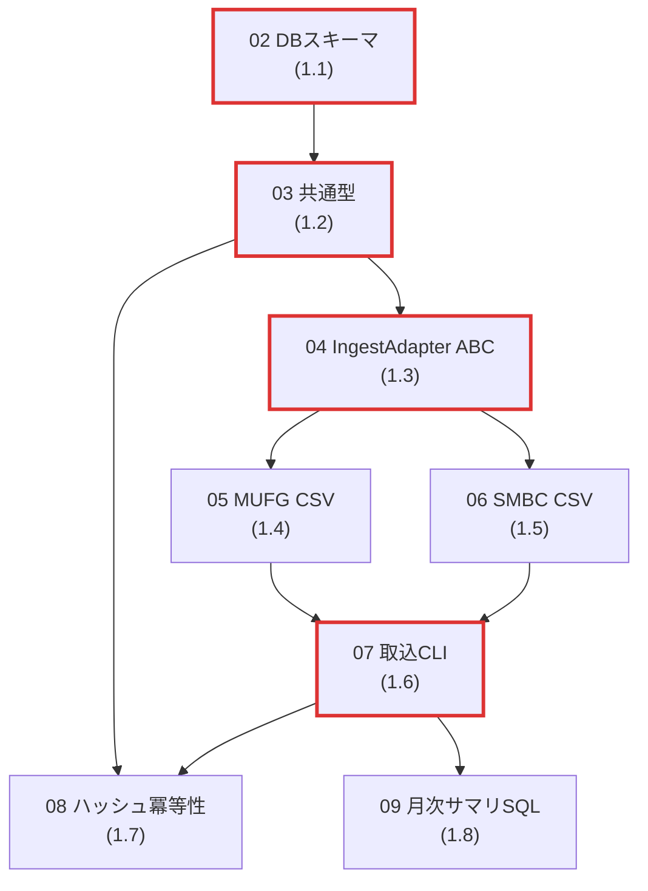

# Phase1 タスクプラン全体俯瞰インデックス

`docs/plans/01-development-plan.md` §4.1 Phase 1（タスク 1.1〜1.8）を、1 issue / 1 ブランチ / 1 PR 単位で着手できる **8 本のタスクプラン**に分解した目次である。本ファイルは Phase1 全体の到達目標・タスク一覧・実装順序・依存関係を一望し、各プランファイルへ確実に到達できるようにすることを目的とする。

## 1. Phase1 全体ゴール

`docs/plans/01-development-plan.md` §3.1 から要約。

> **MVP**: MUFG / SMBC の CSV を CLI から取込み、PostgreSQL に正規化済み取引が格納される。SQL で月次サマリが手計算と一致する。

### 完了条件（同 §3.1）

| ID | 条件 | 担当タスク（プランファイル） |
|---|---|---|
| (a) | `alembic upgrade head` が冪等に実行できる | `02-phase1-db-schema-and-migrations.md` |
| (b) | 同一 CSV を 2 回投入しても `transactions` 行数が増えない | `07-phase1-ingest-cli.md` + `08-phase1-hash-idempotency-tests.md` |
| (c) | サンプル CSV から月次合計を集計する SQL が手計算結果と一致する | `09-phase1-monthly-summary-sql.md` |
| (d) | 全ユニットテストが緑、`pyright` クリーン | 全プラン横断（各プランの「テスト計画」「受入条件」に明記） |

### 関連設計資産

- ADR: ADR-001 / 002 / 004 / 005 / 006 / 007
- design: `design/01-data-model.md`, `design/02-ingest-adapters.md`, `design/08-ingest-flow.md`

## 2. タスク一覧表

| 連番 | タスクID | タイトル | プランファイル | ブランチ名 | 依存タスク | 優先度 |
|---|---|---|---|---|---|---|
| 02 | 1.1 | DBスキーマ・マイグレーション基盤 | `02-phase1-db-schema-and-migrations.md` | `feature/db-schema-initial` | なし | 高 |
| 03 | 1.2 | 共通型（Transaction / Holding / BalanceSnapshot） | `03-phase1-domain-types.md` | `feature/domain-types` | `02-phase1-db-schema-and-migrations.md` | 高 |
| 04 | 1.3 | IngestAdapter ABC | `04-phase1-ingest-adapter-base.md` | `feature/ingest-adapter-base` | `03-phase1-domain-types.md` | 高 |
| 05 | 1.4 | MUFG CSV アダプタ | `05-phase1-mufg-csv-adapter.md` | `feature/adapter-mufg-csv` | `04-phase1-ingest-adapter-base.md` | 中 |
| 06 | 1.5 | SMBC CSV アダプタ | `06-phase1-smbc-csv-adapter.md` | `feature/adapter-smbc-csv` | `04-phase1-ingest-adapter-base.md` | 中 |
| 07 | 1.6 | 取込CLI | `07-phase1-ingest-cli.md` | `feature/ingest-cli` | `05-phase1-mufg-csv-adapter.md`, `06-phase1-smbc-csv-adapter.md` | 高 |
| 08 | 1.7 | ハッシュ冪等性ユニットテスト強化 | `08-phase1-hash-idempotency-tests.md` | `feature/hash-idempotency-tests` | `03-phase1-domain-types.md`, `07-phase1-ingest-cli.md` | 中 |
| 09 | 1.8 | 月次サマリ SQL | `09-phase1-monthly-summary-sql.md` | `feature/monthly-summary-sql` | `07-phase1-ingest-cli.md` | 中 |

### 優先度の付与基準

- **高**: 後続タスクをブロックする上流（クリティカルパス上）。1.1 / 1.2 / 1.3 / 1.6。
- **中**: 並行可能だが Phase1 完了に必須。1.4 / 1.5 / 1.7 / 1.8。
- **低**: Phase1 では発生しない（全タスクが完了条件に必須のため、自然発生する低優先タスクが存在しない）。

## 3. 実装順序

依存関係を考慮した推奨実装順序を示す。1.4 と 1.5 のように「依存が同じで相互独立」なタスクは並行可能。

### 直列の上流（1 → 2 → 3 の順で完了させる）

1. `02-phase1-db-schema-and-migrations.md`（DBスキーマ）
2. `03-phase1-domain-types.md`（共通型）
3. `04-phase1-ingest-adapter-base.md`（IngestAdapter ABC）

### 並行可能なアダプタ層

4a. `05-phase1-mufg-csv-adapter.md`（MUFG）
4b. `06-phase1-smbc-csv-adapter.md`（SMBC）

両方の完了を待ってから次へ進む。

### 統合と検証

5. `07-phase1-ingest-cli.md`（取込CLI、4a / 4b の合流点）
6a. `08-phase1-hash-idempotency-tests.md`（ハッシュ冪等性）
6b. `09-phase1-monthly-summary-sql.md`（月次サマリ SQL）

6a と 6b は CLI 完了後に並行可能。両方完了で Phase1 完了条件 (a)〜(d) が揃う。

### 推奨直列順（1 人で実装する場合）

`02 → 03 → 04 → 05 → 06 → 07 → 08 → 09`

## 4. 依存関係図

`docs/plans/01-development-plan.md` §5 の Phase1 部分を、本プラン群のファイル名で表現したもの。

赤線（クリティカルパス）の根拠: スキーマ → 共通型 → ABC → CLI が直列で詰まり、ここが詰まると Phase1 が完了しない。アダプタ（05/06）は並行可能、検証系（08/09）は CLI 完了後の並行作業。

### 循環依存の不在

依存グラフは DAG であり循環はない（02 が依存元なし、後段は常に番号の小さいタスクのみを参照）。

## 5. Phase1 完了条件カバレッジ

`docs/plans/01-development-plan.md` §3.1 の 4 条件と本プラン群の対応を再掲（本ファイル §1 と整合）。

| 完了条件 | 主担当プラン | 補強プラン |
|---|---|---|
| (a) `alembic upgrade head` 冪等 | `02-phase1-db-schema-and-migrations.md` | – |
| (b) 同一 CSV 2 回投入で行数増えず | `07-phase1-ingest-cli.md` | `08-phase1-hash-idempotency-tests.md` |
| (c) 月次サマリ SQL が手計算と一致 | `09-phase1-monthly-summary-sql.md` | `07-phase1-ingest-cli.md`（投入元） |
| (d) 全ユニットテスト緑 / pyright クリーン | 全プラン横断 | – |

## 6. 品質ゲート

`docs/plans/01-development-plan.md` §7 を Phase1 部分に絞って再掲。

- ユニットテスト + ゴールデンマスタテストが全件緑（10 秒以内）。
- `pyright` クリーン、`ruff` 違反ゼロ。
- サンプル CSV 取込 → 月次サマリが手計算と一致。
- 各タスクの「受入条件」がすべて満たされている。

## 7. プランファイル一覧（参照用）

- `02-phase1-db-schema-and-migrations.md`
- `03-phase1-domain-types.md`
- `04-phase1-ingest-adapter-base.md`
- `05-phase1-mufg-csv-adapter.md`
- `06-phase1-smbc-csv-adapter.md`
- `07-phase1-ingest-cli.md`
- `08-phase1-hash-idempotency-tests.md`
- `09-phase1-monthly-summary-sql.md`

## 8. Phase1 完了後の次ステップ

Phase 2 以降のタスク分解は本ファイルの責務外。`docs/plans/01-development-plan.md` §4.2〜§4.4 を参照し、Phase 2 に着手する時点で同様の `1X-phase2-*.md`（または同等の連番）として展開する。
