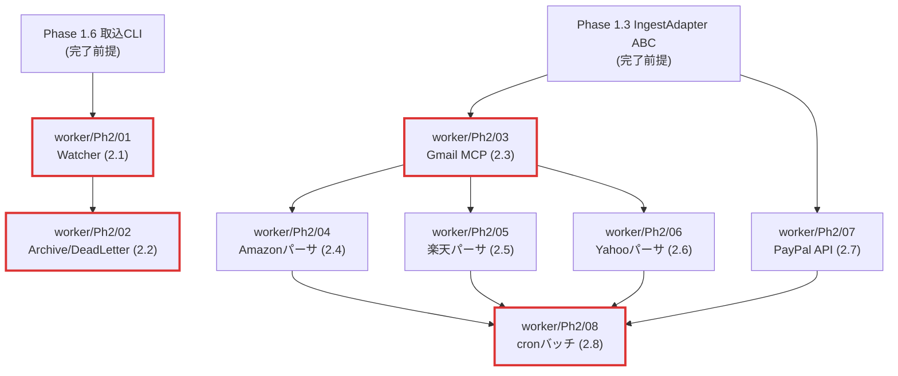

# Phase2 サービス別タスク振り分けインデックス

`docs/plans/01-development-plan.md` §4.2 Phase 2「自動化」のタスク 2.1〜2.8 を、`compose.yml` のサービス（コンテナ）単位に振り分けたディスパッチテーブル。Phase1 の `11-phase1-service-assignments.md` と同じ枠組みで運用する。

## 1. Phase2 全体ゴール

`docs/plans/01-development-plan.md` §3.2 から要約。

> **ゴール**: `/inbox` への CSV 投下 → 5 分以内に DB 反映。Gmail 経由で EC 注文確認メールが自動取込。PayPal API から日次取引が同期。

### 完了条件

| ID | 条件 |
|---|---|
| (a) | Watcher が起動状態で CSV 投下から 5 分以内に取引が DB に現れる |
| (b) | Amazon / 楽天市場 / Yahoo!ショッピングのサンプルメールから取引が抽出される |
| (c) | PayPal Sandbox API から取引が取得できる |
| (d) | パース失敗ファイルが dead letter ディレクトリに移動される |
| (e) | 統合テスト（実 Postgres + 模擬メール）が緑 |

## 2. サービス × Phase2 タスク マトリクス

| サービス | 2.1 | 2.2 | 2.3 | 2.4 | 2.5 | 2.6 | 2.7 | 2.8 | 担当数 |
|---|---|---|---|---|---|---|---|---|---|
| `postgres` | – | – | – | – | – | – | – | – | 0 |
| `worker` | ● | ● | ● | ● | ● | ● | ● | ● | 8 |
| `api` | – | – | – | – | – | – | – | – | 0 |
| `ui` | – | – | – | – | – | – | – | – | 0 |

Phase2 は **すべて `worker` サービスに集約** される。Phase1 で作った取込CLI（`worker/src/kakeibo_worker/ingest/cli.py`）と共通アダプタ（`worker/src/kakeibo_worker/adapters/`）の上に、watchdog / メールパーサ / 外部 API クライアント / cron スケジューラを積み上げる構造。

`compose.yml` の `worker` サービス（`worker/Dockerfile`）の改修は 2.8 cron バッチ運用化で発生する。`postgres` のスキーマは Phase1 で確定済みで Phase2 では変更しない（メール取引・PayPal 取引も `transactions` テーブルに正規化済みの形で投入）。

## 3. サブディレクトリ構成

```
docs/plans/
├── 12-phase2-service-assignments.md  # 本ファイル（Phase2 振り分け）
├── postgres/Ph2/
│   └── README.md                      # 担当タスクなし
├── worker/Ph2/
│   ├── README.md                      # worker サービス Phase2 一覧
│   ├── 01-watcher-service.md          # Phase 2.1
│   ├── 02-archive-and-dead-letter.md  # Phase 2.2
│   ├── 03-gmail-mcp-client.md         # Phase 2.3
│   ├── 04-parser-amazon-mail.md       # Phase 2.4
│   ├── 05-parser-rakuten-mail.md      # Phase 2.5
│   ├── 06-parser-yahoo-mail.md        # Phase 2.6
│   ├── 07-adapter-paypal-api.md       # Phase 2.7
│   └── 08-cron-batch-runner.md        # Phase 2.8
├── api/Ph2/
│   └── README.md                      # 担当タスクなし
└── ui/Ph2/
    └── README.md                      # 担当タスクなし
```

Phase2 の **原典は `docs/plans/01-development-plan.md` §4.2** のみ（Phase1 のような独立詳細プランファイル `12-phase2-*.md` は **作らない方針**：原典が必要十分に簡潔で、サービス別指示書だけで Coder が着手できるため）。原典との乖離時は原典優先。

## 4. 現在の実装状況スナップショット（2026-05-01 時点）

### Phase2 関連で既に存在するもの（Phase 0 で配備済み）

| 資産 | パス | 用途 |
|---|---|---|
| inbox / archive / dead_letter ディレクトリ | `./{inbox,archive,dead_letter}/.gitkeep` | Watcher / Archiver の I/O ボリューム |
| secrets ディレクトリ | `./secrets/{gmail_oauth_token.json,paypal_api_secret.txt,...}` | Docker secret の供給元（`.example` も配置済み） |
| `compose.yml` `worker` サービス | volume マウント / 環境変数（`INBOX_PATH`, `GMAIL_OAUTH_TOKEN_FILE`, `PAYPAL_API_SECRET_FILE`）すでに宣言済 | – |
| Settings ローダー | `shared/kakeibo_shared/config.py` `gmail_oauth_token_path`, `paypal_api_secret` フィールド済み | Phase 2.3 / 2.7 で参照 |
| 依存宣言 | `pyproject.toml` `[project.optional-dependencies].mail` に `mail-parser`, `beautifulsoup4`, `lxml` | Phase 2.4〜2.6 で有効化 |
| `worker/Dockerfile` | 既に `--extra mail --extra pdf --extra llm` でビルド済 | Phase 2.x で追加 build 不要 |

### 未着手（Phase2 で実装）

| 領域 | パス | 帰属タスク |
|---|---|---|
| watchdog Watcher 本体 | `worker/src/kakeibo_worker/ingest/watcher.py`（未作成） | `worker/Ph2/01` |
| アーカイブ / dead letter ロジック | `worker/src/kakeibo_worker/ingest/archiver.py`（未作成） | `worker/Ph2/02` |
| Gmail MCP クライアント | `worker/src/kakeibo_worker/adapters/gmail/`（未作成） + `RawMail` ドメイン型 | `worker/Ph2/03` |
| メールパーサ群（Amazon / 楽天 / Yahoo） | `worker/src/kakeibo_worker/adapters/mail/{amazon,rakuten,yahoo}.py` | `worker/Ph2/04〜06` |
| PayPal API クライアント | `worker/src/kakeibo_worker/adapters/paypal.py` | `worker/Ph2/07` |
| cron バッチランナー | `worker/src/kakeibo_worker/scheduler.py` + `worker/Dockerfile` 改修 | `worker/Ph2/08` |

### Phase2 の前提（Phase1 完了が必要）

`worker/Ph1/` のすべて（`01〜07`）と `postgres/Ph1/01`（DBスキーマ）が完了していることが前提。**Phase1 完了前に Phase2 着手はしない**（クリティカルパス違反）。

## 5. タスク一覧

| 連番 | 担当タスク | 指示書 | 原典（行範囲） | ブランチ | 優先度 |
|---|---|---|---|---|---|
| 01 | Phase 2.1 watchdog Watcher サービス | [`worker/Ph2/01-watcher-service.md`](./worker/Ph2/01-watcher-service.md) | §4.2 L211-221 | `feature/watcher-service` | 🔴 高 |
| 02 | Phase 2.2 アーカイブ移動 + dead letter | [`worker/Ph2/02-archive-and-dead-letter.md`](./worker/Ph2/02-archive-and-dead-letter.md) | §4.2 L223-233 | `feature/archive-and-dead-letter` | 🟠 中 |
| 03 | Phase 2.3 Gmail MCP 接続 | [`worker/Ph2/03-gmail-mcp-client.md`](./worker/Ph2/03-gmail-mcp-client.md) | §4.2 L235-245 | `feature/gmail-mcp-client` | 🔴 高 |
| 04 | Phase 2.4 Amazon メールパーサ | [`worker/Ph2/04-parser-amazon-mail.md`](./worker/Ph2/04-parser-amazon-mail.md) | §4.2 L247-257 | `feature/parser-amazon-mail` | 🟡 中 |
| 05 | Phase 2.5 楽天市場 メールパーサ | [`worker/Ph2/05-parser-rakuten-mail.md`](./worker/Ph2/05-parser-rakuten-mail.md) | §4.2 L259-269 | `feature/parser-rakuten-mail` | 🟡 中 |
| 06 | Phase 2.6 Yahoo!ショッピング メールパーサ | [`worker/Ph2/06-parser-yahoo-mail.md`](./worker/Ph2/06-parser-yahoo-mail.md) | §4.2 L271-281 | `feature/parser-yahoo-mail` | 🟡 中 |
| 07 | Phase 2.7 PayPal API クライアント | [`worker/Ph2/07-adapter-paypal-api.md`](./worker/Ph2/07-adapter-paypal-api.md) | §4.2 L283-293 | `feature/adapter-paypal-api` | 🔴 高 |
| 08 | Phase 2.8 cron バッチ運用化 | [`worker/Ph2/08-cron-batch-runner.md`](./worker/Ph2/08-cron-batch-runner.md) | §4.2 L295-305 | `feature/cron-batch-runner` | 🟠 中 |

## 6. 依存関係図

`docs/plans/01-development-plan.md` §5 の Phase2 部分を再掲。



## 7. 推奨実装順序

直列上流（クリティカルパス）：

```
worker/Ph2/01 (Watcher) → worker/Ph2/02 (Archive/DLQ)
worker/Ph2/03 (Gmail MCP) → worker/Ph2/04 ‖ 05 ‖ 06 (メールパーサ並列)
worker/Ph2/07 (PayPal API)
                                                      ↓
                            worker/Ph2/08 (cron バッチ; 04/05/06/07 完了後)
```

並列可能ペア：
- `worker/Ph2/01` と `worker/Ph2/03` は独立（File watcher と Gmail は別レーン）
- `worker/Ph2/04 / 05 / 06` は Gmail MCP 完了後に 3 体の Coder で並列起動可
- `worker/Ph2/07` は他レーンと完全独立（OAuth ではなく API Secret）

## 8. 共通の前提

| 項目 | 内容 |
|---|---|
| Phase1 完了 | `worker/Ph1/05` (取込CLI) と `postgres/Ph1/01` (スキーマ) が緑であること |
| Docker secret | `secrets/{gmail_oauth_token.json, paypal_api_secret.txt}` が運用環境に配置済（開発時は `.example` ベース） |
| 環境変数 | `INBOX_PATH=/inbox`, `ARCHIVE_PATH=/archive`, `DEAD_LETTER_PATH=/dead_letter`, `GMAIL_OAUTH_TOKEN_FILE`, `PAYPAL_API_SECRET_FILE` は `compose.yml` で宣言済み |
| 依存パッケージ | `pyproject.toml` `[project.optional-dependencies].mail`（mail-parser, beautifulsoup4, lxml）を `--extra mail` で導入 |
| ログ | `structlog` で構造化ログ。トークン・シークレットは絶対にログ出力しない（`agent-rules/12-security-guidelines.md`） |

## 9. Phase2 完了条件カバレッジ

| 完了条件 | 主担当 | 補強 |
|---|---|---|
| (a) CSV 投下 5 分以内に DB 反映 | `worker/Ph2/01` | `worker/Ph2/02` |
| (b) Amazon/楽天/Yahoo メールから取引抽出 | `worker/Ph2/04` / `05` / `06` | `worker/Ph2/03` |
| (c) PayPal Sandbox から取引取得 | `worker/Ph2/07` | – |
| (d) パース失敗ファイルが dead letter へ | `worker/Ph2/02` | `worker/Ph2/01` |
| (e) 統合テスト緑 | 全タスク横断 + `worker/Ph2/08` | – |

## 10. Phase 3 への申し送り

Phase 2 完了時点で Phase 3 着手準備が整う。Phase 3 は `api`（Flask REST API）と `ui`（React Dashboard）に重心が移る（`docs/plans/01-development-plan.md` §4.3）。Phase 3 着手時に `docs/plans/{api,ui}/Ph3/` を新設する。
