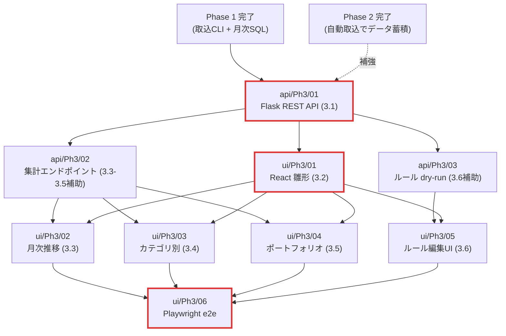

# Phase3 サービス別タスク振り分けインデックス

`docs/plans/01-development-plan.md` §4.3 Phase 3「UX」のタスク 3.1〜3.6 を、`compose.yml` のサービス（コンテナ）単位に振り分けたディスパッチテーブル。Phase 1 の `11-phase1-service-assignments.md` / Phase 2 の `12-phase2-service-assignments.md` と同じ枠組みで運用する。Plannerによる Phase 3 分析の成果物。

## 1. Phase3 全体ゴール

`docs/plans/01-development-plan.md` §3.3 から要約。

> **ゴール**: React Dashboard で残高推移・カテゴリ別支出・ポートフォリオ構成が可視化され、UI からカテゴリルールを編集できる。

### 完了条件

| ID | 条件 |
|---|---|
| (a) | Flask REST API が残高 / 取引 / カテゴリ / ルール の CRUD を提供する |
| (b) | UI で月次推移グラフ・カテゴリ別支出・保有資産が表示される |
| (c) | UI からルール追加・更新・削除が可能 |
| (d) | Playwright e2e で主要シナリオが緑 |
| (e) | `tsc --strict` クリーン |

## 2. サービス × Phase3 タスク マトリクス

| サービス | 3.1 Flask API | 3.2 React 雛形 | 3.3 月次推移 | 3.4 カテゴリ別 | 3.5 ポートフォリオ | 3.6 ルール編集UI | 主担当数 |
|---|---|---|---|---|---|---|---|
| `postgres` | – | – | – | – | – | – | 0 |
| `api` | ● | – | ◐ | ◐ | ◐ | ◐ | 1 + 補助3 |
| `worker` | – | – | – | – | – | – | 0 |
| `ui` | – | ● | ● | ● | ● | ● | 5 |

凡例: ● 主担当 / ◐ 補助（小規模追加） / – 担当なし

### 切り分け方針（Planner判断）

- **3.3〜3.5 は集計エンドポイントを必要とする**ため、`api/Ph3/02-aggregation-endpoints.md` として 3.1 から派生させて分離（原典 3.1 の受入基準は CRUD 止まりで集計 API は明示されていない）。
- **3.6 は API と UI の両方が主担当**。dry-run プレビューエンドポイントを `api/Ph3/03-rule-dry-run-endpoint.md` に切り出し、ルール CRUD 自体は 3.1 に統合。
- **完了条件 (d) Playwright e2e** は横断タスクとして `ui/Ph3/06-e2e-playwright.md` に独立配置。

## 3. サブディレクトリ構成

```
docs/plans/
├── 13-phase3-service-assignments.md          # 本ファイル（Phase3 振り分け）
├── postgres/Ph3/
│   └── README.md                              # 担当タスクなし宣言
├── api/Ph3/
│   ├── README.md                              # api サービス Phase3 一覧
│   ├── 01-flask-rest-api.md                   # Phase 3.1 主担当（CRUD + OpenAPI + 認証）
│   ├── 02-aggregation-endpoints.md            # Phase 3.3〜3.5 補助（集計 API）
│   └── 03-rule-dry-run-endpoint.md            # Phase 3.6 補助（プレビュー）
├── worker/Ph3/
│   └── README.md                              # 担当タスクなし宣言
└── ui/Ph3/
    ├── README.md                              # ui サービス Phase3 一覧
    ├── 01-react-dashboard-scaffold.md         # Phase 3.2
    ├── 02-monthly-trend-chart.md              # Phase 3.3
    ├── 03-category-spending-view.md           # Phase 3.4
    ├── 04-portfolio-view.md                   # Phase 3.5
    ├── 05-rule-editor-ui.md                   # Phase 3.6
    └── 06-e2e-playwright.md                   # 完了条件 (d) Playwright e2e（横断）
```

Phase 3 でも **原典は `docs/plans/01-development-plan.md` §4.3 のみ**（Phase 1 のような独立詳細プランファイルは作らない方針を踏襲）。原典との乖離時は原典優先。

## 4. 現在の実装状況スナップショット（2026-05-01 時点）

### Phase3 関連で既に存在するもの（Phase 0 で配備済み）

| 資産 | パス | 用途 |
|---|---|---|
| Flask アプリファクトリ | `api/src/kakeibo_api/app.py`（`/health` のみ） | Phase 3.1 で Blueprint を追加する起点 |
| api Dockerfile | `api/Dockerfile`（uv マルチステージ、非 root） | Phase 3.1 でも変更不要 |
| Next.js 14 App Router 雛形 | `ui/src/app/{layout,page}.tsx`、`ui/Dockerfile`（standalone build） | Phase 3.2 で拡張 |
| 設定ローダー | `shared/kakeibo_shared/config.py` | 認証バイパスフラグ追加先 |
| Flask / pydantic v2 依存 | `pyproject.toml` `[project.dependencies]` | 既宣言 |

### 未着手（Phase3 で実装）

| 領域 | パス | 帰属タスク |
|---|---|---|
| REST CRUD Blueprint 群 | `api/src/kakeibo_api/blueprints/` | `api/Ph3/01` |
| pydantic スキーマ | `api/src/kakeibo_api/schemas/` | `api/Ph3/01` |
| Tailscale ヘッダ認証 | `api/src/kakeibo_api/auth.py` | `api/Ph3/01` |
| OpenAPI 自動生成 | `api/src/kakeibo_api/openapi.py` | `api/Ph3/01` |
| リポジトリ層 | `shared/kakeibo_shared/db/repositories/` | `api/Ph3/01` |
| 集計 SQL + API | `postgres/src/sql/queries/{monthly_balance_trend,category_spending,portfolio_composition}.sql`, `api/src/kakeibo_api/blueprints/aggregations.py` | `api/Ph3/02` |
| ルール dry-run + Categorizer | `worker/src/kakeibo_worker/categorizer/`, `api/src/kakeibo_api/blueprints/rules.py` 拡張 | `api/Ph3/03` |
| UI ライブラリ・コンポーネント | `ui/lib/`, `ui/components/`, `ui/styles/` | `ui/Ph3/01` |
| 各ページ | `ui/src/app/{balances,categories,portfolio,rules}/` | `ui/Ph3/02〜05` |
| Playwright e2e | `tests/e2e/` | `ui/Ph3/06` |

### Phase3 の前提（Phase 1 / Phase 2 完了が必要）

`worker/Ph1/01〜07` + `postgres/Ph1/01` + `worker/Ph2/01〜08` がすべて緑であること。**Phase 1 / 2 完了前に Phase 3 着手はしない**（クリティカルパス違反、データ枯渇でテスト無効化）。

## 5. タスク一覧

| 連番 | 担当タスク | 指示書 | 原典（行範囲） | ブランチ | 優先度 |
|---|---|---|---|---|---|
| api/01 | Phase 3.1 Flask REST API | [`api/Ph3/01-flask-rest-api.md`](./api/Ph3/01-flask-rest-api.md) | §4.3 L309-319 | `feature/flask-rest-api` | 🔴 高 |
| api/02 | Phase 3.3〜3.5 集計エンドポイント | [`api/Ph3/02-aggregation-endpoints.md`](./api/Ph3/02-aggregation-endpoints.md) | §4.3 L333-365 | `feature/api-aggregation-endpoints` | 🟡 中 |
| api/03 | Phase 3.6 ルール dry-run | [`api/Ph3/03-rule-dry-run-endpoint.md`](./api/Ph3/03-rule-dry-run-endpoint.md) | §4.3 L367-377 | `feature/api-rule-dry-run` | 🟡 中 |
| ui/01 | Phase 3.2 React Dashboard 雛形 | [`ui/Ph3/01-react-dashboard-scaffold.md`](./ui/Ph3/01-react-dashboard-scaffold.md) | §4.3 L321-331 | `feature/react-dashboard-scaffold` | 🔴 高 |
| ui/02 | Phase 3.3 月次推移グラフ | [`ui/Ph3/02-monthly-trend-chart.md`](./ui/Ph3/02-monthly-trend-chart.md) | §4.3 L333-343 | `feature/monthly-trend-chart` | 🟡 中 |
| ui/03 | Phase 3.4 カテゴリ別支出ビュー | [`ui/Ph3/03-category-spending-view.md`](./ui/Ph3/03-category-spending-view.md) | §4.3 L345-355 | `feature/category-spending-view` | 🟡 中 |
| ui/04 | Phase 3.5 ポートフォリオ構成ビュー | [`ui/Ph3/04-portfolio-view.md`](./ui/Ph3/04-portfolio-view.md) | §4.3 L357-365 | `feature/portfolio-view` | 🟡 中 |
| ui/05 | Phase 3.6 ルール編集UI | [`ui/Ph3/05-rule-editor-ui.md`](./ui/Ph3/05-rule-editor-ui.md) | §4.3 L367-377 | `feature/rule-editor-ui` | 🔴 高 |
| ui/06 | Phase 3 完了条件 (d) Playwright e2e | [`ui/Ph3/06-e2e-playwright.md`](./ui/Ph3/06-e2e-playwright.md) | §3.3 完了条件 (d) | `feature/playwright-e2e` | 🟡 中 |

## 6. 依存関係図



## 7. 推奨実装順序（モードB: Claude単体サブエージェント協調）

クリティカルパス: `Phase1/Phase2 完了 → api/Ph3/01 → ui/Ph3/01 → ui/Ph3/06`（最低 4 直列）。

```
1. api/Ph3/01 (Flask REST API + 認証 + OpenAPI)
2. api/Ph3/02 ‖ api/Ph3/03           （Coder 2体並列可）
3. ui/Ph3/01 (React雛形)              （api/01 完了で着手可、api/02・03 と並列も可）
4. ui/Ph3/02 ‖ ui/Ph3/03 ‖ ui/Ph3/04  （Coder 3体並列可、要 api/02 + ui/01）
5. ui/Ph3/05 (ルール編集UI)            （要 api/03 + ui/01）
6. ui/Ph3/06 (Playwright e2e)         （ui/02-05 完了後）
```

## 8. 横断的な技術判断（Plannerによる確定）

| # | 判断事項 | 採用 | 理由 |
|---|---|---|---|
| 1 | **Vite 移行 vs Next.js 維持** | **Next.js 14 維持** | Phase 0 の Dockerfile / standalone build / healthcheck / 既存テスト保護（`agent-rules/00-core-principles.md` §1）。原典の「Vite + TypeScript + React」は本質である「TypeScript + React」を採用、ビルド基盤は Next.js を継続。差分は `ui/Ph3/01` 内で実装方針として明記。 |
| 2 | **状態管理** | `@tanstack/react-query` v5 | データ取得・キャッシュ・mutate の業界標準。Redux / Zustand は YAGNI。 |
| 3 | **API クライアント型** | OpenAPI から `openapi-typescript` で機械生成 | 手書きは重複リスク。`api/Ph3/01` で `/api/openapi.json` を valid 保証。 |
| 4 | **OpenAPI 生成（API 側）** | `flask-smorest` | pydantic v2 連携・自動 spec 生成・Swagger UI 同梱。`apispec` 単体は手書き spec 多。 |
| 5 | **認証** | Caddy が `Tailscale-User-Login` ヘッダを後段に伝播、API はそれを必須化、dev は `KAKEIBO_API_AUTH_BYPASS=1` でバイパス | ADR-010 と整合。 |
| 6 | **グラフライブラリ** | `recharts` | React ファースト・MIT・Server Component 互換。 |
| 7 | **e2e 配置** | `tests/e2e/`（リポジトリルート、pytest 系と並列） | `agent-rules/11-testing-strategy.md` テスト階層と整合。 |
| 8 | **ReDoS 対策** | サーバ側 `signal.SIGALRM` ベースのタイムアウト + パターン長制限 | `re2` Python バインディングは NAS ビルド負荷増。`signal` は Linux コンテナ前提で十分。 |
| 9 | **ライブラリ追加先** | API 拡張は `pyproject.toml`、UI は `ui/package.json` | Phase 1〜2 と同じ慣習。 |
| 10 | **CSS / フォント** | `tailwindcss` + デザイントークン、フォントは `Noto Sans JP` + 日本語ディスプレイフォント。**Inter / Roboto / system-ui を使用しない** | `agent-rules/15-frontend-design.md` の禁止事項を厳守。 |

## 9. Phase3 完了条件カバレッジ

| 完了条件 | 主担当 | 補強 |
|---|---|---|
| (a) Flask REST API CRUD | `api/Ph3/01` | `api/Ph3/02`, `api/Ph3/03` |
| (b) 残高推移 / カテゴリ / 保有資産表示 | `ui/Ph3/02` / `03` / `04` | `api/Ph3/02` |
| (c) UI からルール CRUD | `ui/Ph3/05` | `api/Ph3/01`, `api/Ph3/03` |
| (d) Playwright e2e 主要シナリオ緑 | `ui/Ph3/06` | – |
| (e) `tsc --strict` クリーン | 全 ui タスク横断 | – |

## 10. 既知の課題・申し送り

- **Phase 1 / 2 完了が必須前提**。未完了状態では `api/Ph3/01〜03` の統合テストが意味をなさない。
- **リスク R-09（ReDoS）**: `api/Ph3/03` 内で `signal.SIGALRM` タイムアウト + パターン長制限で対応。
- **リスク R-10（Tailscale Funnel）**: ADR-010 §結果で「Funnel 不使用」確定済み、Phase3 に影響なし。
- **認証ヘッダ実機検証**は Phase 3 内では unit test レベルで完結、本番 Caddy 経路の検証は Phase 4.6 リリース時に実施。
- **SQLAlchemy ORM 不採用**を Phase 3 でも継続（Phase 1 方針）。Phase 4 以降に再検討余地。
- **Vite vs Next.js の原典差分**: 原典 §4.3 Phase 3.2 の文言「Vite + TypeScript + React」と本振り分けの実装方針（Next.js 維持）が異なる点について、`ui/Ph3/01` 内で実装方針として明示し、原典は不変扱い。気になる場合は ADR-013 候補として将来起票可能。

## 11. Phase 4 への申し送り

Phase 3 完了時点で API + UI が揃い、Phase 4「Polish」に着手可能。Phase 4 着手時に `docs/plans/{api,ui,worker}/Ph4/` を新設する。
- `api/Ph3/03` の `categorizer/rules.py` を Phase 4.1 LLM 分類サービスで再利用
- `ui/Ph3/05` のルール編集 UI を Phase 4.2 半自動学習へ拡張
- Playwright e2e を Phase 4 のリグレッション一式に組み込み
