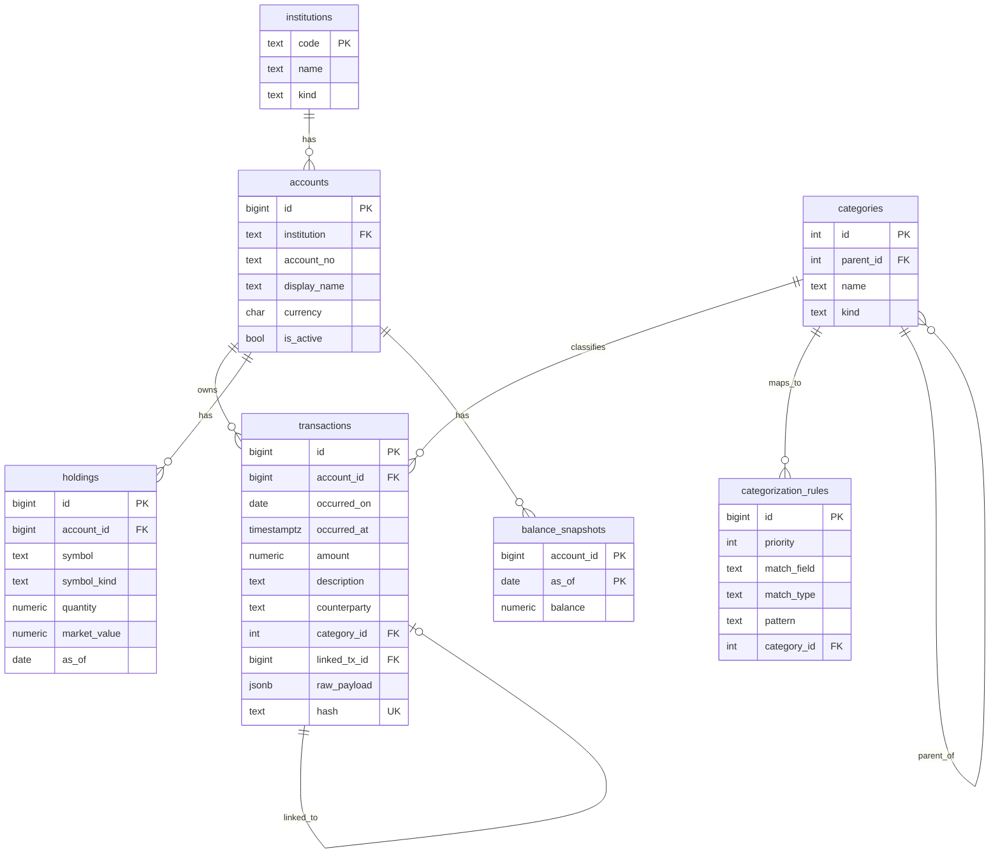

# データモデル詳細設計

## 1. 概要

本ドキュメントは、個人向け資産・家計管理アプリケーションの永続化層（PostgreSQL 16）に関する詳細設計を示す。概要設計（`docs/plans/00-initial-design.md` §4）を土台とし、テーブル単位のフィールド意味、制約、インデックス戦略、想定クエリ、マイグレーション運用までを実装可能なレベルで詳述する。

データモデルは「フロー（取引）」「ストック（残高・保有資産）」「ディメンション（機関・口座・カテゴリ）」「ルール」の4層に分かれる。フローとストックを併存させることで、整合性検証（前日残高 + 当日取引合計 = 当日残高）を可能にし、データレイク的な発想で `raw_payload` を JSONB で保持して再パースを許す（ADR-004）。

## 2. ER図



## 3. DDL

### 3.1 機関・口座マスタ

```sql
CREATE TABLE institutions (
  code        TEXT PRIMARY KEY,
  name        TEXT NOT NULL,
  kind        TEXT NOT NULL CHECK (kind IN ('bank','securities','fund','ec','wallet'))
);

CREATE TABLE accounts (
  id              BIGSERIAL PRIMARY KEY,
  institution     TEXT NOT NULL REFERENCES institutions(code),
  account_no      TEXT NOT NULL,
  display_name    TEXT NOT NULL,
  currency        CHAR(3) NOT NULL DEFAULT 'JPY',
  is_active       BOOLEAN NOT NULL DEFAULT TRUE,
  opened_on       DATE,
  closed_on       DATE,
  note            TEXT,
  UNIQUE (institution, account_no)
);
CREATE INDEX ON accounts (institution) WHERE is_active = TRUE;
```

`account_no` はマスキング後の口座番号（下4桁等）または機関側のアカウントID。生の口座番号を平文で保存しない方針（§10 セキュリティ）に従う。

### 3.2 カテゴリ

```sql
CREATE TABLE categories (
  id        SERIAL PRIMARY KEY,
  parent_id INT REFERENCES categories(id),
  name      TEXT NOT NULL,
  kind      TEXT NOT NULL CHECK (kind IN ('expense','income','transfer','investment')),
  display_order INT NOT NULL DEFAULT 0,
  is_active BOOLEAN NOT NULL DEFAULT TRUE,
  UNIQUE (parent_id, name)
);
```

階層は最大2層（大カテゴリ「食費」→ 小カテゴリ「外食」「食材」）を想定。`kind` は集計時の符号制御（`expense` は負、`income` は正、`transfer`/`investment` は損益から除外）に使う。

### 3.3 取引（フロー）

```sql
CREATE TABLE transactions (
  id              BIGSERIAL PRIMARY KEY,
  account_id      BIGINT NOT NULL REFERENCES accounts(id),
  occurred_on     DATE NOT NULL,
  occurred_at     TIMESTAMPTZ,
  amount          NUMERIC(18,4) NOT NULL,
  currency        CHAR(3) NOT NULL DEFAULT 'JPY',
  description     TEXT NOT NULL,
  counterparty    TEXT,
  category_id     INT REFERENCES categories(id),
  category_source TEXT CHECK (category_source IN ('rule','llm','manual')),
  category_confidence NUMERIC(4,3),
  linked_tx_id    BIGINT REFERENCES transactions(id),
  raw_payload     JSONB NOT NULL,
  source_file     TEXT,
  imported_at     TIMESTAMPTZ NOT NULL DEFAULT NOW(),
  hash            TEXT NOT NULL UNIQUE
);
CREATE INDEX ON transactions (account_id, occurred_on);
CREATE INDEX ON transactions (category_id, occurred_on);
CREATE INDEX ON transactions (occurred_on) WHERE category_id IS NULL;
CREATE INDEX ON transactions USING GIN (raw_payload jsonb_path_ops);
```

| フィールド | 意味 |
|---|---|
| `amount` | 入金正、出金負（NUMERIC、ADR-005） |
| `occurred_on` | 取引発生日（タイムゾーン非依存） |
| `occurred_at` | UTC基準のタイムスタンプ。EC通知メールなど時刻が判明する場合のみ |
| `description` | 機関の摘要欄をそのまま保持（カテゴリ分類のキー） |
| `counterparty` | 相手先（メール由来は店舗名等を抽出） |
| `category_source` | 分類経路。`rule`/`llm`/`manual` で再学習対象を区別 |
| `category_confidence` | LLM分類時の確信度（0.000〜1.000） |
| `linked_tx_id` | 連動取引（カード利用→銀行引落）のリンク（ADR-006、`worker/docs/design/06-reconciler.md`） |
| `raw_payload` | 元レコード全体のJSON保持。再パース可能 |
| `hash` | 冪等性用のSHA256。詳細は §5 |

### 3.4 残高・保有資産（ストック）

```sql
CREATE TABLE holdings (
  id              BIGSERIAL PRIMARY KEY,
  account_id      BIGINT NOT NULL REFERENCES accounts(id),
  symbol          TEXT NOT NULL,
  symbol_kind     TEXT NOT NULL CHECK (symbol_kind IN ('cash','stock','fund','crypto','bond')),
  quantity        NUMERIC(18,6) NOT NULL,
  market_value    NUMERIC(18,4),
  unit_cost       NUMERIC(18,6),
  as_of           DATE NOT NULL,
  raw_payload     JSONB NOT NULL,
  UNIQUE (account_id, symbol, as_of)
);
CREATE INDEX ON holdings (as_of);

CREATE TABLE balance_snapshots (
  account_id      BIGINT NOT NULL REFERENCES accounts(id),
  as_of           DATE NOT NULL,
  balance         NUMERIC(18,4) NOT NULL,
  source          TEXT CHECK (source IN ('csv','api','calculated','manual')),
  PRIMARY KEY (account_id, as_of)
);
```

`balance_snapshots.source = 'calculated'` は前日残高と当日取引合計から導出した値を表す。CSV取込時の `'csv'` 値とのクロスチェックで残高整合性を検証する（`worker/docs/design/06-reconciler.md`）。

### 3.5 ルール

```sql
CREATE TABLE categorization_rules (
  id          BIGSERIAL PRIMARY KEY,
  priority    INT NOT NULL DEFAULT 100,
  match_field TEXT NOT NULL CHECK (match_field IN ('description','counterparty','amount_sign')),
  match_type  TEXT NOT NULL CHECK (match_type IN ('regex','contains','exact')),
  pattern     TEXT NOT NULL,
  category_id INT NOT NULL REFERENCES categories(id),
  is_active   BOOLEAN NOT NULL DEFAULT TRUE,
  created_at  TIMESTAMPTZ NOT NULL DEFAULT NOW(),
  updated_at  TIMESTAMPTZ NOT NULL DEFAULT NOW(),
  note        TEXT
);
CREATE INDEX ON categorization_rules (priority) WHERE is_active = TRUE;
```

評価順序は `priority ASC, id ASC`。詳細は `worker/docs/design/03-categorization-engine.md`。

## 4. 設計判断

| 項目 | 判断 | 理由 / 関連ADR |
|---|---|---|
| `raw_payload` JSONB保持 | 元レコードを失わない | パーサ改修時に再変換可能。データレイク発想（ADR-004） |
| `amount` NUMERIC(18,4) | float禁止 | 投信口数や為替で丸め誤差が致命的（ADR-005） |
| `quantity` NUMERIC(18,6) | 投信口数の精度確保 | ひふみ等の口数は小数6桁まで使用 |
| `hash` UNIQUE | 冪等性保証 | 再取込での重複を防ぐ（ADR-006） |
| `linked_tx_id` 自己参照 | 連動取引の事後リンク | カード利用と引落を後から連結 |
| `holdings` と `balance_snapshots` の併存 | 二重持ち | 整合性検証に活用 |
| `category_source` | 分類経路を明示 | 再学習・LLM評価指標用 |
| `category_id` NULL許容 | 未分類状態を表現 | 取込直後に分類失敗してもINSERT可能 |
| マルチ通貨設計 | `currency` カラムを各テーブルに保持 | 現状はJPYのみだが将来拡張余地（§11） |
| 削除しない設計 | 物理削除なし | `is_active` フラグで論理削除 |

## 5. hash の生成規則（ADR-006）

```
hash = SHA256(
  account_id || '|' ||
  occurred_on || '|' ||
  amount || '|' ||
  description || '|' ||
  raw_payload_canonical_json
)
```

`raw_payload_canonical_json` は JSON を再帰的にキーソートして文字列化したもの。同一CSVを再取込しても同一hashになり、UNIQUE制約により二重INSERTを防ぐ。

`description` だけでは衝突する可能性（同日同額の取引）があるため、`raw_payload` まで含めることで実質一意性を担保する。

## 6. インデックス戦略

| インデックス | 目的 | 想定クエリ |
|---|---|---|
| `transactions(account_id, occurred_on)` | 口座別月次取引一覧 | ダッシュボード月次表示 |
| `transactions(category_id, occurred_on)` | カテゴリ別集計 | 月次カテゴリサマリ |
| `transactions(occurred_on) WHERE category_id IS NULL` | 未分類抽出 | 部分インデックス、未分類UI |
| `transactions USING GIN (raw_payload)` | JSONB検索 | デバッグ・再パース時 |
| `holdings(as_of)` | 全資産時系列 | ポートフォリオ推移グラフ |
| `categorization_rules(priority) WHERE is_active` | ルール評価 | 取込時の毎回評価 |

## 7. 制約一覧

| 制約 | 目的 |
|---|---|
| `transactions.hash` UNIQUE | 冪等性（ADR-006） |
| `accounts(institution, account_no)` UNIQUE | 同一口座の重複防止 |
| `holdings(account_id, symbol, as_of)` UNIQUE | スナップショット重複防止 |
| `balance_snapshots(account_id, as_of)` PK | 同上 |
| `transactions.category_source` CHECK | 不正値防止 |
| `transactions.amount` NOT NULL | 必須 |

## 8. 想定クエリ例

### 8.1 月次サマリ（収支）

```sql
SELECT
  date_trunc('month', occurred_on)::date AS month,
  c.kind,
  SUM(t.amount) AS total
FROM transactions t
JOIN categories c ON c.id = t.category_id
WHERE t.occurred_on >= date_trunc('year', CURRENT_DATE)
GROUP BY 1, 2
ORDER BY 1, 2;
```

### 8.2 カテゴリ別月次集計

```sql
SELECT
  date_trunc('month', t.occurred_on)::date AS month,
  COALESCE(p.name, c.name) AS top_category,
  SUM(ABS(t.amount)) AS amount
FROM transactions t
JOIN categories c ON c.id = t.category_id
LEFT JOIN categories p ON p.id = c.parent_id
WHERE c.kind = 'expense'
  AND t.occurred_on >= CURRENT_DATE - INTERVAL '12 months'
GROUP BY 1, 2
ORDER BY 1, 2;
```

### 8.3 残高推移（全口座合算）

```sql
SELECT
  bs.as_of,
  SUM(bs.balance) AS total_balance
FROM balance_snapshots bs
JOIN accounts a ON a.id = bs.account_id
WHERE a.is_active = TRUE
GROUP BY bs.as_of
ORDER BY bs.as_of;
```

### 8.4 未分類取引の抽出

```sql
SELECT id, occurred_on, amount, description, counterparty
FROM transactions
WHERE category_id IS NULL
ORDER BY occurred_on DESC
LIMIT 50;
```

### 8.5 ポートフォリオ構成（最新）

```sql
WITH latest AS (
  SELECT account_id, symbol, MAX(as_of) AS as_of
  FROM holdings
  GROUP BY account_id, symbol
)
SELECT h.symbol_kind, SUM(h.market_value) AS total_value
FROM holdings h
JOIN latest l USING (account_id, symbol, as_of)
GROUP BY h.symbol_kind;
```

## 9. マイグレーション運用方針

- ツール: Alembic（SQLAlchemy が依存上含まれる前提）。Phase 1 で導入。
- 命名: Alembic 既定の `<rev>_<short>.py`（`alembic revision -m "<short>"` 実行で自動採番）。
- ロールバック: 全マイグレーションに `downgrade()` を実装。データ破壊的変更は別マイグレーションへ分離。
- データ移行: スキーマ変更とデータ移行を同一マイグレーションに含めない（コミット粒度の原則と一致）。
- `raw_payload` の互換性: パーサ改修時はマイグレーションでなく、ワーカ側でのリプレイスクリプトで処理する。スキーマ自体は不変。

## 10. 既知の課題・申し送り

- 為替レートテーブル（`fx_rates`）は将来追加。現状はJPYのみ前提。
- 口座番号の暗号化方式（pgcrypto等）は §10 セキュリティ設計で確定後に追加。
- `categories` の初期データ（マスタ）は `postgres/src/sql/seeds/categories.sql` に分離して投入する想定（ADR-014 の per-service レイアウトに従う）。
- LLM 分類時の `category_confidence` 閾値（自動採用 vs 未分類保留）は `worker/docs/design/03-categorization-engine.md` で定義。
