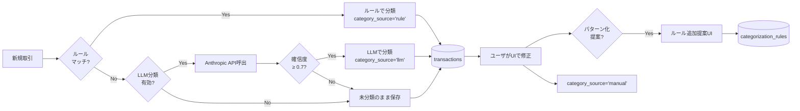
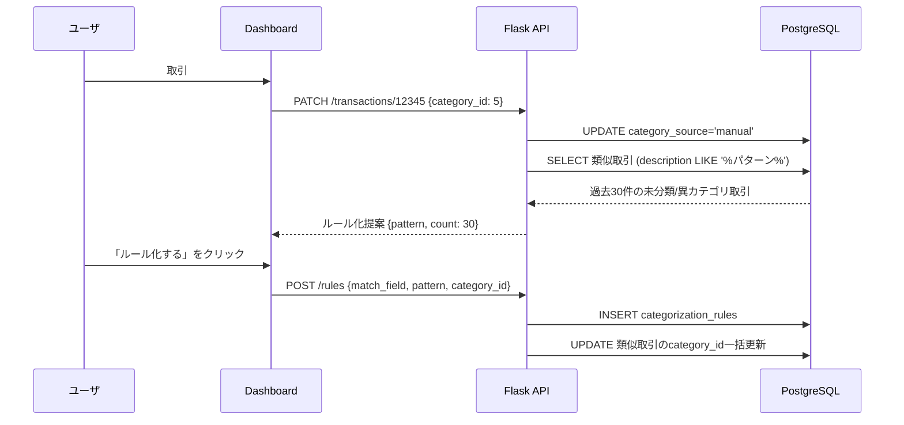

# カテゴリ分類エンジン詳細設計

## 1. 概要

本ドキュメントは、取引データに対するカテゴリ分類エンジンの詳細設計を示す。概要設計 §6 を土台とし、ルール / LLM / 手動 の3層分類戦略（ADR-008）を実装可能なレベルで詳述する。

支出分析を実用にするには **80%以上の自動分類精度** が必要。3層を組み合わせることで段階的にカバレッジを拡大し、コスト（LLM API課金）と精度のバランスを取る。

## 2. 3層分類フロー



## 3. ルールエンジン

### 3.1 仕様

`categorization_rules` テーブルに登録された行を `priority ASC, id ASC` の順に評価し、最初にマッチしたものを採用する。

| フィールド | 内容 |
|---|---|
| `priority` | 評価順序（小さいほど優先）。デフォルト100 |
| `match_field` | `description` / `counterparty` / `amount_sign` |
| `match_type` | `regex` / `contains` / `exact` |
| `pattern` | マッチパターン |
| `category_id` | 適用カテゴリ |
| `is_active` | 無効化フラグ |

### 3.2 評価アルゴリズム

```python
# categorizer/rules.py
import re
from dataclasses import dataclass
from typing import Iterable, Optional


@dataclass
class Rule:
    id: int
    priority: int
    match_field: str
    match_type: str
    pattern: str
    category_id: int


def match_rule(rule: Rule, tx: "Transaction") -> bool:
    target = {
        "description": tx.description,
        "counterparty": tx.counterparty or "",
        "amount_sign": "+" if tx.amount > 0 else "-",
    }[rule.match_field]

    if rule.match_type == "exact":
        return target == rule.pattern
    if rule.match_type == "contains":
        return rule.pattern in target
    if rule.match_type == "regex":
        return re.search(rule.pattern, target) is not None
    raise ValueError(f"unknown match_type: {rule.match_type}")


def classify(tx: "Transaction", rules: Iterable[Rule]) -> Optional[int]:
    """マッチした最初のルールの category_id を返す。マッチしなければ None。"""
    for rule in sorted(rules, key=lambda r: (r.priority, r.id)):
        if match_rule(rule, tx):
            return rule.category_id
    return None
```

### 3.3 初期ルールセット例（抜粋）

最初に手動で約100件のルールを登録すれば、反復性の高い固定費・食費・交通費で90%以上をカバーできる。

| priority | match_field | match_type | pattern | カテゴリ |
|---|---|---|---|---|
| 10 | description | regex | `^給与` | 収入/給与 |
| 10 | description | contains | `家賃` | 固定費/家賃 |
| 20 | description | contains | `東京電力` | 公共料金/電気 |
| 20 | description | contains | `東京ガス` | 公共料金/ガス |
| 20 | description | contains | `東京都水道` | 公共料金/水道 |
| 20 | description | regex | `(NTT\|ドコモ\|ソフトバンク\|au)` | 通信費/携帯 |
| 30 | counterparty | contains | `セブン-イレブン` | 食費/コンビニ |
| 30 | counterparty | regex | `(ファミリーマート\|ローソン\|ミニストップ)` | 食費/コンビニ |
| 30 | counterparty | regex | `(マクドナルド\|スターバックス\|サイゼリヤ)` | 食費/外食 |
| 40 | counterparty | regex | `JR.*` | 交通費/鉄道 |
| 40 | counterparty | contains | `Suica チャージ` | 交通費/IC |
| 50 | counterparty | regex | `(楽天証券\|SMBC日興\|ひふみ)` | 投資/積立 |
| 50 | description | contains | `振替` | 振替/口座間 |
| 60 | description | regex | `(国民年金\|健康保険\|住民税\|所得税)` | 税金 |
| 70 | counterparty | regex | `(Amazon\|アマゾン)` | 娯楽/オンライン |
| 80 | description | regex | `(病院\|クリニック\|薬局)` | 医療 |

優先度設計の方針:
- 10番台: 確実に一意な摘要（給与、家賃）
- 20-30番台: 大手チェーン名や明確な公共サービス
- 40-50番台: 業種カテゴリ（交通、投資）
- 60-80番台: より広いマッチ
- 90-99: フォールバック

## 4. LLM分類

### 4.1 呼び出し条件

- ルール未マッチ取引のみをバッチでAnthropic APIに送信
- バッチサイズ: 最大20件/リクエスト
- リトライ: 指数バックオフ、最大3回
- 確信度 `< 0.7` の場合は未分類保留（`category_id IS NULL`）

### 4.2 プロンプト設計

#### システムプロンプト

```
あなたは日本の家計簿カテゴリ分類アシスタントです。
取引摘要・相手先・金額符号から、以下のカテゴリ一覧から最適なものを1つ選び、
JSON で回答してください。確信度（0.0〜1.0）も付与してください。

カテゴリ一覧（id, name, kind）:
- 1, 食費/外食, expense
- 2, 食費/食材, expense
- 3, 食費/コンビニ, expense
- 4, 交通費/鉄道, expense
- 5, 交通費/IC, expense
- ...（全カテゴリを列挙）

確信度の基準:
- 1.0: 摘要にカテゴリ名そのものが含まれる、または明確なチェーン名
- 0.8: 業種・文脈から強く推定される
- 0.5: 推測の域を出ない
- 0.0: まったく判断不能（この場合 category_id=null）
```

#### ユーザプロンプト

```
以下の取引を分類してください:

[
  {"id": 12345, "occurred_on": "2026-04-15", "amount": -1280, "description": "○○マート 渋谷店", "counterparty": "○○マート"},
  {"id": 12346, "occurred_on": "2026-04-15", "amount": -3500, "description": "AMZN.CO.JP", "counterparty": null}
]
```

#### 期待される出力（JSON）

```json
{
  "results": [
    {"id": 12345, "category_id": 2, "confidence": 0.85, "reason": "スーパーの可能性が高い"},
    {"id": 12346, "category_id": 70, "confidence": 0.95, "reason": "Amazon購入"}
  ]
}
```

### 4.3 確信度判定

| confidence | 処理 |
|---|---|
| ≥ 0.9 | `category_source='llm'` で自動採用 |
| 0.7〜0.9 | `category_source='llm'`, UI上で要確認バッジ表示 |
| < 0.7 | `category_id=NULL`, 未分類として保留 |

`category_confidence` カラムに値を保存し、後で評価指標に使う。

### 4.4 コスト試算

- 取引数: 月300件（うち未分類想定30件 = ルール9割カバー時）
- バッチ: 20件/req → 月2リクエスト
- モデル: Claude Sonnet
- 想定コスト: 月数十円程度。無視できる範囲。

## 5. 半自動学習フロー

### 5.1 ユーザ修正からのルール提案

ユーザがUI上で `category_source='manual'` として分類を修正した際、システムは類似取引を検出し、ルール化を提案する。



### 5.2 パターン抽出ロジック

修正した取引の `description` / `counterparty` から、共通する語句を抽出する：

1. 形態素解析（janome等）で名詞のみ抽出
2. 同一カテゴリに分類された他の取引との共通語句を計算
3. 最頻出語句を提案パターンとする
4. ユーザが採否を選択

例: 「セブン-イレブン渋谷店」「セブン-イレブン新宿店」→ 共通語句「セブン-イレブン」を提案。

## 6. category_source の使い分け

| 値 | 意味 | 再分類対象 |
|---|---|---|
| `rule` | ルールエンジンが自動分類 | ルール変更時に再評価候補 |
| `llm` | LLMが自動分類 | 低確信度のものはUIで要確認 |
| `manual` | ユーザが手動分類 | 不変。優先度最高、上書きされない |
| NULL | 未分類 | 取込直後の状態。UI上で対応必要 |

再取込・ルール変更時は `category_source IN ('rule', NULL)` の取引のみ再評価する。`'manual'` と `'llm'` は明示的なバッチでのみ更新。

## 7. 評価指標

定期的に以下の指標を算出し、`docs/operations/categorizer-metrics.md` (将来) に蓄積する。

| 指標 | 算出式 | 目標値 |
|---|---|---|
| ルール分類率 | `count(rule) / count(total)` | ≥ 80% |
| LLM分類率 | `count(llm) / count(total)` | ≤ 15% |
| 未分類率 | `count(NULL) / count(total)` | ≤ 5% |
| 誤分類率 | `count(manual修正後) / count(rule + llm)` | ≤ 5% |
| LLM平均確信度 | `avg(category_confidence)` | ≥ 0.85 |

```sql
-- 月次評価クエリ
SELECT
  date_trunc('month', occurred_on)::date AS month,
  category_source,
  COUNT(*) AS n,
  AVG(category_confidence) AS avg_conf
FROM transactions
WHERE occurred_on >= CURRENT_DATE - INTERVAL '6 months'
GROUP BY 1, 2
ORDER BY 1, 2;
```

## 8. 既知の課題・申し送り

- 形態素解析ライブラリの選定（janome/sudachi）は Phase 4 で確定。
- LLM 呼び出しのレート制限・コスト上限機構（月額キャップ）は Phase 4 で実装。
- ルール優先度の自動チューニング（よくマッチするルールを上位に）は将来検討。
- 連動取引（カード→銀行）の `transfer` 分類は Reconciler の責務（`worker/docs/design/06-reconciler.md`）。
- `category_confidence` の閾値（現状0.7/0.9）は実運用後にチューニング。
