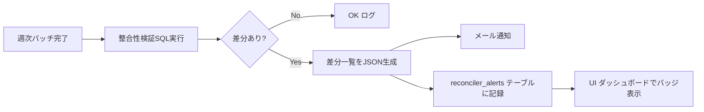

# 連動取引・残高整合性 詳細設計

## 1. 概要

本ドキュメントは、複数機関間で論理的に同一である「連動取引（linked transaction）」の検出・リンク付け、および残高整合性（前日残高 + 当日取引合計 = 当日残高）の検証を担う Reconciler コンポーネントの詳細設計を示す。

「連動取引」の典型例:

- カード利用 → 翌月の銀行口座引落
- PayPay チャージ（銀行から PayPay 残高へ）
- 楽天市場購入 → 楽天カード請求 → 銀行引落（3段階）
- 証券口座への入金 → 投資信託買付

これらを `transactions.linked_tx_id` で結合し、家計簿上の二重計上を防ぐ。冪等性は ADR-006 の `hash` UNIQUE で担保される。

## 2. 連動取引の定義

| 種別 | 例 | linked_tx_id 設定方針 |
|---|---|---|
| カード利用と銀行引落 | Amazon購入(月内) → 翌月10日銀行引落 | 引落側 → 利用側 を参照 |
| PayPay チャージ | 銀行から PayPay へ | PayPay側 → 銀行側 を参照 |
| 証券入金 | 銀行から証券口座へ | 証券側 → 銀行側 を参照 |
| 内部振替 | 自分名義の口座間 | どちらか一方が他方を参照（順序は to側 → from側） |

集計時は `linked_tx_id IS NOT NULL` 側を `transfer` カテゴリとして除外し、片側のみカウントする。

## 3. マッチングアルゴリズム

### 3.1 シグネチャ

```python
def find_link_candidates(
    tx: Transaction,
    candidates: list[Transaction],
    *,
    amount_tolerance: Decimal = Decimal("0"),
    date_window_days: int = 60,
    description_threshold: float = 0.6,
) -> list[tuple[Transaction, float]]:
    """tx に対する連動取引の候補を確信度付きで返す。"""
```

### 3.2 マッチング条件（AND）

候補は以下の全条件を満たす必要がある:

1. **金額**: `abs(a.amount + b.amount) <= amount_tolerance`（符号反転ペアであること）
2. **日付**: `0 <= abs(a.occurred_on - b.occurred_on) <= date_window_days`
3. **口座**: `a.account_id != b.account_id`
4. **既リンク無**: `a.linked_tx_id IS NULL AND b.linked_tx_id IS NULL`

### 3.3 確信度スコア

候補のうち、以下の重み付き和でスコアを算出して降順:

| 要素 | 重み | 算出 |
|---|---|---|
| 金額一致度 | 0.4 | `1.0 - abs(diff) / abs(tx.amount)` |
| 日付近接度 | 0.3 | `1.0 - days_diff / date_window_days` |
| 摘要類似度 | 0.2 | Jaccard係数（n-gram） |
| 機関相性 | 0.1 | 既知ペア（楽天市場×楽天カード等）にボーナス |

スコア `>= 0.8` で自動リンク、`0.5 <= スコア < 0.8` でUI上に「確認候補」表示、`< 0.5` は無視。

### 3.4 機関相性テーブル

```python
# worker/src/kakeibo_worker/reconciler/affinity.py
KNOWN_PAIRS = {
    ("rakuten_ichiba", "rakuten_card"): 1.0,
    ("amazon", "rakuten_card"): 0.7,
    ("amazon", "smbc"): 0.7,
    ("paypal", "smbc"): 0.5,
    ("yahoo_shopping", "paypay"): 1.0,
    # 銀行間振替
    ("mufg", "smbc"): 0.6,
    ("smbc", "rakuten_sec"): 0.8,
}
```

実運用で観測された組み合わせを継続的に追加する。

## 4. linked_tx_id 更新方針

### 4.1 リンク方向

- 「先に発生した取引（カード利用）」を `from_tx`、「後で発生した取引（銀行引落）」を `to_tx` とする
- `to_tx.linked_tx_id = from_tx.id` を設定
- `from_tx.linked_tx_id` は NULL のまま

理由: カード利用は確実に発生する側で、引落側を「派生」と捉えるほうが意味的に明瞭。

### 4.2 SQL

```sql
-- 自動リンク
UPDATE transactions
SET linked_tx_id = $from_id,
    category_id = (SELECT id FROM categories WHERE name = '振替' LIMIT 1),
    category_source = 'rule'
WHERE id = $to_id
  AND linked_tx_id IS NULL;
```

### 4.3 リンク解除

UI上でユーザがリンクを解除する場合:

```sql
UPDATE transactions SET linked_tx_id = NULL WHERE id = $to_id;
-- カテゴリは元に戻さない（手動対応）
```

## 5. 残高整合性検証ロジック

### 5.1 アサーション

各口座について以下が成立すること:

```
balance_snapshots(d)   = balance_snapshots(d-1) + Σ transactions(account_id, d)
```

### 5.2 検証クエリ

```sql
WITH daily AS (
  SELECT account_id, occurred_on, SUM(amount) AS day_sum
  FROM transactions
  GROUP BY account_id, occurred_on
),
expected AS (
  SELECT
    bs.account_id,
    bs.as_of,
    LAG(bs.balance) OVER (PARTITION BY bs.account_id ORDER BY bs.as_of) AS prev_balance,
    bs.balance AS actual_balance,
    COALESCE(d.day_sum, 0) AS day_sum
  FROM balance_snapshots bs
  LEFT JOIN daily d ON d.account_id = bs.account_id AND d.occurred_on = bs.as_of
)
SELECT
  account_id,
  as_of,
  prev_balance,
  day_sum,
  actual_balance,
  prev_balance + day_sum AS calculated_balance,
  actual_balance - (prev_balance + day_sum) AS diff
FROM expected
WHERE prev_balance IS NOT NULL
  AND ABS(actual_balance - (prev_balance + day_sum)) > 0.0001
ORDER BY account_id, as_of;
```

差分が出た日について、その口座のCSV（`raw_payload`）を再確認する。

### 5.3 許容誤差

- JPY 口座: 厳密一致（差0）
- USD/外貨口座: 為替レート反映前のため、当面は警告のみ
- 投信口座: 評価額変動を含むため、`balance_snapshots` には適用しない（`holdings` で別管理）

## 6. 不整合検出時のアラート

### 6.1 検出フロー



### 6.2 アラートテーブル（将来）

```sql
CREATE TABLE reconciler_alerts (
  id           BIGSERIAL PRIMARY KEY,
  account_id   BIGINT NOT NULL REFERENCES accounts(id),
  as_of        DATE NOT NULL,
  expected_balance NUMERIC(18,4),
  actual_balance   NUMERIC(18,4),
  diff         NUMERIC(18,4),
  detected_at  TIMESTAMPTZ NOT NULL DEFAULT NOW(),
  resolved_at  TIMESTAMPTZ,
  note         TEXT,
  UNIQUE (account_id, as_of)
);
```

ユーザがUI上で「確認済み」とマークすると `resolved_at` が更新される。

### 6.3 通知メッセージ例

```
[Kakeibo] 残高整合性アラート
口座: 三菱UFJ銀行 ****1234
日付: 2026-04-15
期待値: 350,000円
実残高: 349,500円
差分: -500円

考えられる原因:
- ATM手数料の取込漏れ
- 同日複数取引の取込順序問題
- CSVの取引漏れ
```

## 7. 再実行戦略

### 7.1 Reconciler の冪等性

- マッチング処理は何度実行しても同じ結果を返す
- 既に `linked_tx_id IS NOT NULL` の取引はスキップ
- ユーザが手動で解除した取引（`linked_tx_id = NULL` 設定後）は再リンクしない

そのために手動解除を区別する必要があるかは要検討。当面は「解除後も再マッチで再リンクされる」挙動を許容し、不便なら `linked_tx_no_auto BOOLEAN` フラグを後で追加する。

### 7.2 過去データの再評価

新しい機関相性ルール追加時、過去全データを対象に再実行できるCLIを提供:

```bash
docker compose run --rm worker python -m kakeibo_worker.reconciler.run \
  --since 2026-01-01 \
  --until 2026-04-30 \
  --dry-run
```

`--dry-run` で差分のみ表示。実行時は `--apply`。

## 8. 実装上の留意点

| 項目 | 内容 |
|---|---|
| 計算量 | 全取引のN×Nマッチングは避け、日付窓 + インデックス利用で線形に近づける |
| バッチサイズ | 1日分の取引×60日窓で十分。月次バッチで 1万件×600件 = 600万比較は許容範囲 |
| カテゴリ更新 | 自動リンク時に `transfer` カテゴリ強制設定はユーザ意図と齟齬する可能性。設定で無効化可能に |
| 手動リンク | UI上で2取引を選択して「これらをリンク」と指示できる機能（Phase 4） |

## 9. 既知の課題・申し送り

- 1対多リンク（1回のチャージが複数取引に分割される等）は現設計では未対応。`linked_tx_id` を多対1にするか、別テーブル化を検討。
- 為替レート連動の取引（USD建てカード→JPY引落）は当面手動リンクのみ。
- 機関相性テーブルは実運用で観測された組合せを継続追加する運用設計が必要。
- 残高整合性検証は週次バッチ末尾で自動実行する。Phase 4 で実装。
- 取引取込順序が口座間で前後するケース（メール先行 / CSV後発）でも、`linked_tx_id` は事後リンクで対処可能。
