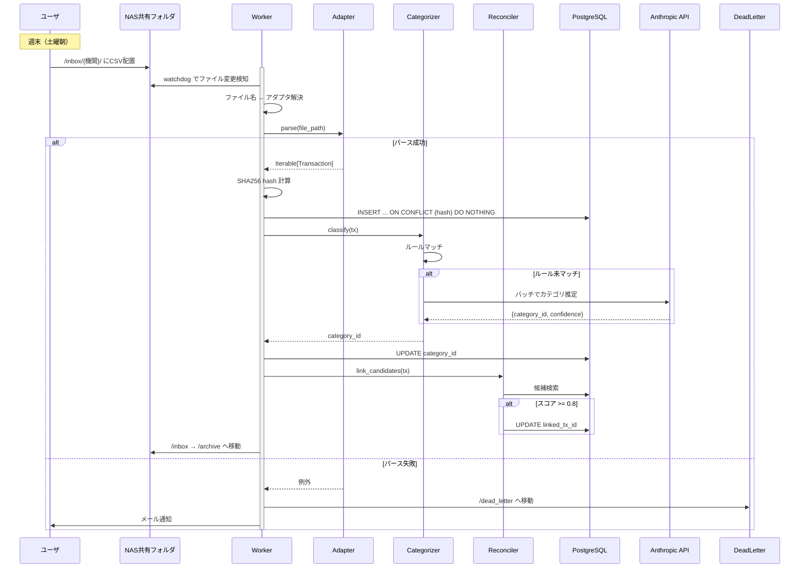
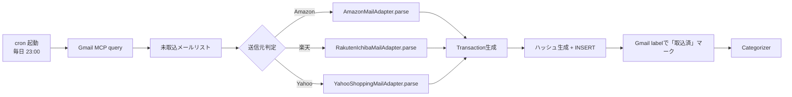
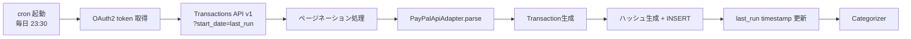
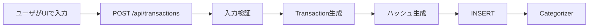

# 取込フロー詳細設計

## 1. 概要

本ドキュメントは、各機関からのデータを Worker コンテナで受け取り、正規化し、PostgreSQL に永続化するまでの取込フロー詳細設計を示す。概要設計 §3.3 を土台に、ファイル監視 / メール取得 / API 取得 / 手動入力 の各経路、原本保管ルール、エラーハンドリング、リトライ、dead letter、バッチスケジュールを定義する。

設計原則:
- ハイブリッド取得方式（ADR-001）に基づき4経路すべてを統一フローへ収束
- 共通インターフェース `IngestAdapter`（ADR-007、`worker/docs/design/02-ingest-adapters.md`）に統一
- 冪等性は `transactions.hash` UNIQUE で担保（ADR-006）
- 取り込み済み原本は `/archive/` へ永久保管

## 2. 取込フロー全体（拡張版シーケンス図）



## 3. 経路別フロー

### 3.1 Watcher（ファイル監視）

#### 3.1.1 watchdog 設定

```python
# worker/watcher.py
from pathlib import Path
from watchdog.events import FileSystemEventHandler
from watchdog.observers import Observer

class IngestEventHandler(FileSystemEventHandler):
    def __init__(self, dispatcher):
        self.dispatcher = dispatcher

    def on_created(self, event):
        if event.is_directory:
            return
        path = Path(event.src_path)
        # 一時ファイルは無視（macOSのリソースフォーク等）
        if path.name.startswith(("._", ".DS_Store", "~$")):
            return
        # ファイル書き込み完了を待つ（サイズが2秒安定）
        if not _wait_until_stable(path):
            return
        self.dispatcher.handle(path)


def start_watcher(inbox: Path, dispatcher) -> Observer:
    observer = Observer()
    observer.schedule(IngestEventHandler(dispatcher), str(inbox), recursive=True)
    observer.start()
    return observer
```

#### 3.1.2 アダプタ解決

ディレクトリ構造で機関を特定:

```
/inbox/
  mufg/          → MufgCsvAdapter
  smbc/          → SmbcCsvAdapter
  smtb/          → SmtbCsvAdapter
  hifumi/        → HifumiPdfAdapter
  rakuten_sec/   → RakutenSecCsvAdapter
  smbc_nikko/    → SmbcNikkoCsvAdapter
  paypay/        → PayPayCsvAdapter
```

ディスパッチャは `path.parent.name` を機関コードとして `ADAPTER_REGISTRY[code]` を解決する。

#### 3.1.3 ファイル安定化判定

ダウンロード途中のファイルを処理しないため、サイズが2秒間変わらないことを確認してから処理開始:

```python
def _wait_until_stable(path: Path, *, interval: float = 0.5, stable_for: float = 2.0) -> bool:
    if not path.exists():
        return False
    last_size = -1
    stable_since = None
    while True:
        try:
            size = path.stat().st_size
        except FileNotFoundError:
            return False
        if size == last_size:
            if stable_since and (time.monotonic() - stable_since) >= stable_for:
                return True
            stable_since = stable_since or time.monotonic()
        else:
            last_size = size
            stable_since = None
        time.sleep(interval)
```

### 3.2 Mail Fetcher（Gmail MCP）

#### 3.2.1 取得方針

- Gmail MCP の readonly スコープで定期実行
- 対象: Amazon / 楽天市場 / Yahoo!ショッピング の注文確認メール
- 検索クエリ例: `from:auto-confirm@amazon.co.jp newer_than:7d`

#### 3.2.2 フロー



#### 3.2.3 取込済管理

- Gmail label `kakeibo/processed` を取込成功時に付与
- 検索クエリで `-label:kakeibo/processed` を併用し再取込を防止
- メールIDを `raw_payload.gmail_message_id` に保存（DB側でも参照可能）

### 3.3 API Fetcher（PayPal）

#### 3.3.1 認証

- OAuth2 Client Credentials grant
- アクセストークンは1時間有効、自動リフレッシュ
- Client ID / Secret は Docker secret 経由

#### 3.3.2 フロー



#### 3.3.3 last_run 管理

`worker_state` テーブルに最終実行時刻を保存:

```sql
CREATE TABLE worker_state (
  key         TEXT PRIMARY KEY,
  value       TEXT NOT NULL,
  updated_at  TIMESTAMPTZ NOT NULL DEFAULT NOW()
);
INSERT INTO worker_state (key, value) VALUES ('paypal.last_run', '2026-04-29T23:30:00Z');
```

PayPal Transactions API は最大31日前までの遡及が可能。日次で十分な範囲。

### 3.4 手動入力UI

#### 3.4.1 用途

- 現金支出（コンビニで現金払い等、CSVに残らない取引）
- 機関側でデータ取得不可な取引（友人との立替金等）
- 訂正（既存取引の修正は別経路、UIから直接DB更新）

#### 3.4.2 フロー



手動入力の `raw_payload` には `{"manual": true, "input_at": "..."}` を保存し、後で識別可能にする。

## 4. 原本保管ルール（/inbox → /archive 移動）

### 4.1 ディレクトリ構造

```
/archive/
  mufg/
    2026/
      04/
        三菱UFJ_明細_20260415.csv
        三菱UFJ_明細_20260415.csv.meta.json
  smbc/
    2026/
      04/
        ...
```

### 4.2 移動規則

1. パース成功後、原本を `/archive/{institution}/{YYYY}/{MM}/{filename}` に移動
2. 同名ファイル衝突時は `_001`, `_002` を付加
3. メタデータJSON（取込時刻、件数、ファイルハッシュ）を `.meta.json` で並置
4. 移動はファイルシステム rename（同一ボリューム前提でアトミック）

### 4.3 メタデータ例

```json
{
  "source_file": "/archive/mufg/2026/04/三菱UFJ_明細_20260415.csv",
  "institution": "mufg",
  "imported_at": "2026-04-16T03:15:00+09:00",
  "transaction_count": 47,
  "balance_snapshot_count": 47,
  "file_sha256": "abcdef...",
  "adapter_version": "1.0.0"
}
```

## 5. エラーハンドリング・リトライ・dead letter

### 5.1 エラー分類

| 種別 | 例 | 対応 |
|---|---|---|
| 一時的（ネットワーク等） | OAuth リフレッシュ失敗、API 5xx | 指数バックオフでリトライ（最大3回） |
| パース失敗 | CSVフォーマット変更、文字コード不一致 | dead letter へ移動 + メール通知 |
| データ不整合 | hash重複以外のDB制約違反 | dead letter + メール通知 |
| 致命的（DBダウン等） | postgres unreachable | Worker停止、ヘルスチェックで検知 |

### 5.2 リトライ戦略

```python
# worker/retry.py
import time
import random

def retry(max_attempts: int = 3, base_delay: float = 1.0):
    def decorator(func):
        def wrapper(*args, **kwargs):
            attempt = 0
            while True:
                try:
                    return func(*args, **kwargs)
                except RetriableError as e:
                    attempt += 1
                    if attempt >= max_attempts:
                        raise
                    delay = base_delay * (2 ** (attempt - 1)) + random.uniform(0, 0.5)
                    time.sleep(delay)
        return wrapper
    return decorator
```

`RetriableError` は HTTP 5xx / コネクションエラー / OAuthトークン期限切れに対応。

### 5.3 Dead Letter 構造

```
/dead_letter/
  2026-04-16T03-15-00_mufg_明細.csv
  2026-04-16T03-15-00_mufg_明細.csv.error.txt
```

`.error.txt` にスタックトレースとパース時のメタ情報を書き込む。週次で `dead_letter` 内のファイル一覧をメール通知し、ユーザが手動対応する。

### 5.4 メール通知

```
[Kakeibo] 取込エラー
ファイル: /dead_letter/2026-04-16T03-15-00_mufg_明細.csv
時刻: 2026-04-16 03:15:00
原因: UnicodeDecodeError at line 12
対処: dead_letter フォルダから原本を確認の上、必要であれば修正して /inbox/ に再投下してください。
```

## 6. バッチスケジュール（cron）

| ジョブ | スケジュール | 内容 |
|---|---|---|
| Watcher | 常時稼働 | watchdog で /inbox を監視 |
| Mail Fetcher | 毎日 23:00 | Gmail MCP からEC通知取得 |
| PayPal Fetcher | 毎日 23:30 | PayPal Transactions API |
| Reconciler 自動リンク | 毎日 23:45 | 過去60日分を再評価 |
| 残高整合性検証 | 週次 日曜 04:00 | 全口座の整合性チェック |
| LLM 未分類バッチ | 毎日 00:30 | 未分類取引をLLMで分類 |
| Obsidian 月次サマリ | 月初 03:00 | 前月分のMarkdown生成 |
| バックアップ | 毎日 02:00 | pg_dump |

cron 設定は worker コンテナ内で `cron` または `supervisor` で管理する。

```cron
# worker/crontab
0 23 * * * /usr/local/bin/python -m worker.tasks.fetch_mail
30 23 * * * /usr/local/bin/python -m worker.tasks.fetch_paypal
45 23 * * * /usr/local/bin/python -m worker.tasks.reconcile
30 0 * * * /usr/local/bin/python -m worker.tasks.classify_unclassified
0 4 * * 0 /usr/local/bin/python -m worker.tasks.verify_balance
0 3 1 * * /usr/local/bin/python -m tools.export_obsidian --month $(date -d 'last month' +\%Y-\%m)
```

## 7. 取込のアトミック性

1取引のINSERTから`/archive`移動までを論理的に1トランザクションとして扱いたいが、ファイルシステムとDBは別系統のため厳密なatomicityは不可能。代替策:

- DBは `INSERT ... ON CONFLICT DO NOTHING` で重複耐性
- アーカイブ移動失敗時はDBには既に入っている可能性 → ファイルは `/inbox` に残ったままなので次回起動時にまた処理 → hashで重複INSERT回避
- このため「2回処理されてもデータが破壊されない」ことが保証される（冪等性）

## 8. 既知の課題・申し送り

- Watcher プロセスのクラッシュ時、再起動までに `/inbox/` に投下された変更は検知されない。再起動時に未処理ファイル一覧をスキャンする初期処理を実装。
- Gmail MCP のレート制限・認可期限切れ時のリカバリ手順を runbook 化（Phase 2）。
- PayPal API の歴史的データ（31日超前）取得は手動CSV exportで補完。
- 大量ファイル投下時（年次データ移行等）のバックプレッシャ制御は将来検討。
- Watcher と Mail Fetcher が同時に同一取引を処理しても、hash UNIQUE で衝突する設計。
